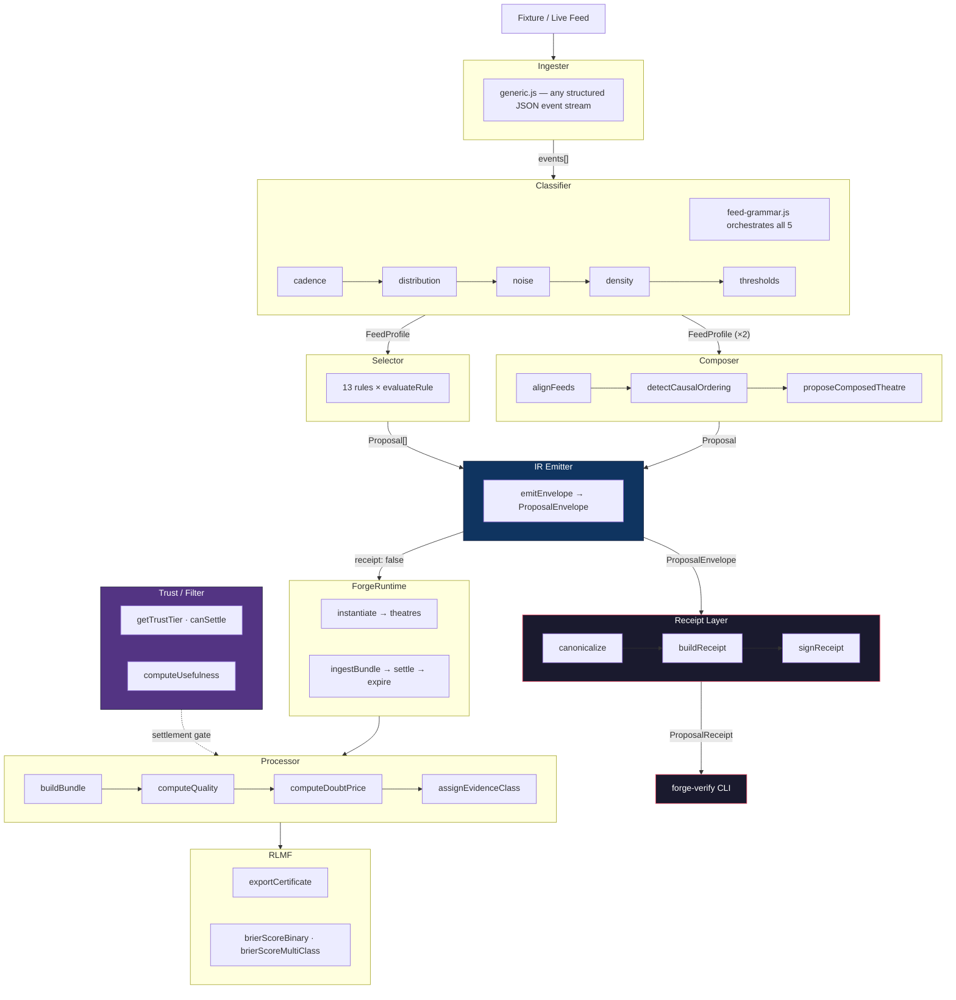

<!-- AGENT-CONTEXT
name: forge
type: construct
purpose: >
  Feed-adaptive oracle factory for the Echelon prediction market framework.
  Classifies any structured event feed across five grammar dimensions (cadence,
  distribution, noise, density, thresholds), selects Theatre templates via
  rule-based matching, proposes composed theatres from feed pairs, exports
  Brier-scored RLMF certificates, and generates signed ProposalReceipts with
  ed25519 verification via the forge-verify CLI. The Uniswap factory for prediction surfaces.
key_files:
  - README.md
  - src/index.js
  - src/classifier/feed-grammar.js
  - src/selector/rules.js
  - src/selector/template-selector.js
  - src/composer/compose.js
  - src/receipt/receipt-builder.js
  - src/receipt/sign.js
  - bin/forge-verify.js
  - spec/construct.json
  - spec/receipt-v0.json
interfaces:
  core:
    - ForgeConstruct        # src/index.js:37
    - classify              # src/classifier/feed-grammar.js:34
    - selectTemplates       # src/selector/template-selector.js:130
    - evaluateRule          # src/selector/template-selector.js:70
    - alignFeeds                  # src/composer/compose.js:28
    - detectCausalOrdering        # src/composer/compose.js:63
    - proposeComposedTheatre      # src/composer/compose.js:118
  theatres:
    - threshold_gate        # src/theatres/threshold-gate.js
    - cascade               # src/theatres/cascade.js
    - divergence            # src/theatres/divergence.js
    - regime_shift          # src/theatres/regime-shift.js
    - anomaly               # src/theatres/anomaly.js
    - persistence           # src/theatres/persistence.js
  receipts:
    - buildReceipt          # src/receipt/receipt-builder.js:24
    - signReceipt           # src/receipt/sign.js
    - verifySignature       # src/receipt/sign.js
    - canonicalize          # src/receipt/canonicalize.js
    - loadKeyring           # src/receipt/keyring.js
    - forge-verify (CLI)    # bin/forge-verify.js
  oracles:
    - oracle-trust (T0-T3)  # src/trust/oracle-trust.js:61
dependencies: []
ecosystem:
  - repo: 0xHoneyJar/loa
    role: framework
    interface: constructs
    protocol: loa-constructs@0.1.0
  - repo: echelon/framework
    role: runtime
    interface: theatre-registry
    protocol: echelon-theatres@0.1.0
capability_requirements:
  - filesystem: read (scope: fixture files)
version: v0.3.0
installation_mode: standalone
trust_level: L1-local
-->

# FORGE

<!-- provenance: OPERATIONAL -->
FORGE (Feed-Adaptive Oracle & Runtime Generator) is Echelon's automatic Theatre Factory — the feed-native supply side that turns any structured event stream into prediction market proposals without human curation. It classifies feeds across five grammar dimensions (cadence, distribution, noise, density, thresholds), selects matching Theatre templates via 13 rule-based matching rules, exports Brier-scored RLMF training certificates, and generates signed ProposalReceipts that prove a specific envelope was produced from a specific input under a specific policy and code version. Receipts are independently verifiable via the `forge-verify` CLI. FORGE is not one of many possible Theatre Factory inputs — it is the specific component that makes the factory automatic, covering domains where statistical structure in live data is the only reliable signal. The Uniswap factory for prediction surfaces.

## Key Capabilities
<!-- provenance: CODE-FACTUAL -->

- **classify** — 5-dimension feed grammar classifier. Orchestrates all five classifiers and returns a `FeedProfile` with cadence, distribution, noise, density, and threshold classifications. (`src/classifier/feed-grammar.js:34`)
- **classifyCadence** — Cadence classifier: `event_driven` / `seconds` / `minutes` / `hours` / `multi_cadence` / `irregular`. Uses median inter-event delta, jitter coefficient, and bimodal histogram detection. (`src/classifier/cadence.js:129`)
- **classifyDistribution** — Distribution classifier: `bounded_numeric` / `unbounded_numeric` / `composite` / `categorical`. Uses bounds, max-growth coefficient, and multimodal histogram analysis. (`src/classifier/distribution.js:127`)
- **classifyNoise** — Noise classifier: `spike_driven` / `steady` / `mixed` / `irregular`. Uses spike detection, lag-1 autocorrelation, and linear trend t-stat. (`src/classifier/noise.js:255`)
- **classifyDensity** — Density classifier: `single_point` / `single_global_instrument` / `sparse_network` / `dense_network` / `multi_tier`. Uses sensor count, coverage metadata, coordinate events, GeoJSON feature count, and multi-tier detection. (`src/classifier/density.js:140`)
- **classifyThresholds** — Threshold classifier: `regulatory` / `physical` / `statistical` / `none`. Matches histogram breakpoints against EPA AQI, NOAA Kp, and NOAA R regulatory tables. (`src/classifier/thresholds.js:199`)
- **selectTemplates** — Rule-based Theatre template selector. Evaluates all 13 rules against a `FeedProfile` and returns all fired proposals with confidence scores. Uses greedy matching for duplicate template resolution. (`src/selector/template-selector.js:130`)
- **evaluateRule** — Evaluates a single condition rule against a `FeedProfile` using dot-path field access and six comparison operators (equals, in, gt, lt, gte, lte). (`src/selector/template-selector.js:70`)
- **RULES** — 13 template selection rules covering three backing specs: 5 TREMOR (seismic), 5 CORONA (space weather), 3 BREATH (air quality). (`src/selector/rules.js:35`)
- **alignFeeds** — Temporal alignment of two event streams within a sliding window. For each event in stream A, finds the nearest event in stream B within ±windowMs. Returns matched pairs only. (`src/composer/compose.js:28`)
- **detectCausalOrdering** — Mean timestamp offset analysis to detect leading/lagging relationship between two aligned feed streams. Returns `leader` (`'A'`|`'B'`|`'concurrent'`) and `lag_ms`. (`src/composer/compose.js:63`)
- **proposeComposedTheatre** — Three-rule composition engine. Evaluates two classified feeds + their temporal relationship and proposes the Theatre that neither feed would generate alone. Rules: `threshold_with_arrival_predictor` (bounded + arrival predictor → threshold_gate), `co_bounded_divergence` (two bounded + concurrent → divergence), `cascade_amplifier` (spike_driven + bounded → cascade). Returns null if no rule fires. (`src/composer/compose.js:118`)
- **emitEnvelope** — Versioned ProposalEnvelope emitter. Annotates proposals with deterministic `proposal_id` (SHA-256 dedup key), `brier_type`, and per-proposal `usefulness_score` (null when economic filter not invoked). Produces the IR contract consumed by Echelon's admission gate. (`src/ir/emit.js:71`)
- **computeUsefulness** — Scores a Theatre proposal across four dimensions: `population_impact`, `regulatory_relevance`, `predictability`, `actionability`. Returns a 0–1 composite usefulness score. (`src/filter/usefulness.js:113`)
- **buildBundle** — Evidence bundle constructor: computes quality score, doubt price (uncertainty), settlement assessment, and assembles the full bundle object from a raw feed event. (`src/processor/bundles.js:49`)
- **getTrustTier** / **canSettle** / **validateSettlement** — T0–T3 oracle trust enforcement. `canSettle` returns true only for T0/T1. PurpleAir (T3) enforced as non-settling source. (`src/trust/oracle-trust.js:61`)
- **exportCertificate** — RLMF training certificate export with Brier score, position history, and calibration bucket. Supports binary and multi-class scoring. (`src/rlmf/certificates.js:91`)
- **createReplay** — Deterministic replay of a recorded feed session. Loads a fixture, replays events with configurable speed, and produces reproducible pipeline output. (`src/replay/deterministic.js:84`)
- **buildReceipt** — Orchestrates receipt construction: canonicalizes raw input, computes input/output/policy hashes, assembles code identity, and optionally signs. Returns a ProposalReceipt conforming to `spec/receipt-v0.json`. (`src/receipt/receipt-builder.js:24`)
- **canonicalize** — JCS-subset/v0 canonical JSON serializer. Deterministic key ordering, type-safe value encoding (no `undefined`, `NaN`, `Infinity`). (`src/receipt/canonicalize.js`)
- **sha256** — SHA-256 hash with `sha256:` prefix for receipt fields. (`src/receipt/hash.js`)
- **signReceipt** / **verifySignature** — Ed25519 signing and verification. Fail-closed: throws if no signing key available. Signature format: `ed25519:` prefixed base64. (`src/receipt/sign.js`)
- **loadKeyring** / **getPublicKey** — Keyring management for receipt verification. Loads `keys/forge-keyring.json`. (`src/receipt/keyring.js`)
- **getCodeIdentity** — Returns code identity triple `{ git_sha, package_lock_sha, node_version }` for receipt `code_version` field. `package_lock_sha` is null (zero-dep posture). (`src/receipt/code-identity.js`)
- **computePolicyHash** — Hashes the active rule set and regulatory tables to produce the receipt `policy_hash`. (`src/receipt/policy-hasher.js`)
- **forge-verify** — Independent replay verifier CLI. Re-runs the pipeline on original input and compares output hash against receipt. Exit codes: 0=MATCH, 1=MISMATCH, 2=ERROR. (`bin/forge-verify.js`)
- **ForgeConstruct** — Top-level construct class. `.analyze(fixturePath)` runs the full pipeline (ingest → classify → select). `.analyze(path, { receipt: true })` adds a ProposalReceipt to the result. `.getCertificates()` returns accumulated RLMF state (defensive copy). (`src/index.js:37`)

## Architecture
<!-- provenance: DERIVED -->
FORGE follows a linear pipeline: fixture files flow through an ingester, then a 5-dimension classifier, then a rule-based selector that emits Theatre proposals. A parallel processor layer handles evidence bundle construction and trust enforcement. Feed pairs enter the composer for composed Theatre proposals. All resolved theatres export RLMF certificates.



Directory structure:
```
./src
./src/index.js
./src/ingester
./src/ingester/generic.js
./src/classifier
./src/classifier/feed-grammar.js
./src/classifier/cadence.js
./src/classifier/distribution.js
./src/classifier/noise.js
./src/classifier/density.js
./src/classifier/thresholds.js
./src/classifier/data
./src/classifier/data/regulatory-epa-aqi.json
./src/classifier/data/regulatory-noaa-kp.json
./src/classifier/data/regulatory-noaa-r.json
./src/selector
./src/selector/rules.js
./src/selector/template-selector.js
./src/theatres
./src/theatres/threshold-gate.js
./src/theatres/cascade.js
./src/theatres/divergence.js
./src/theatres/regime-shift.js
./src/theatres/anomaly.js
./src/theatres/persistence.js
./src/processor
./src/processor/bundles.js
./src/processor/quality.js
./src/processor/uncertainty.js
./src/processor/settlement.js
./src/trust
./src/trust/oracle-trust.js
./src/trust/adversarial.js
./src/rlmf
./src/rlmf/certificates.js
./src/filter
./src/filter/usefulness.js
./src/composer
./src/composer/compose.js
./src/replay
./src/replay/deterministic.js
./src/ir
./src/ir/emit.js
./src/receipt
./src/receipt/canonicalize.js
./src/receipt/code-identity.js
./src/receipt/hash.js
./src/receipt/keyring.js
./src/receipt/policy-hasher.js
./src/receipt/receipt-builder.js
./src/receipt/sign.js
./src/runtime
./src/runtime/lifecycle.js
./src/adapter
./src/adapter/usgs-live.js
./src/adapter/swpc-live.js
./spec
./bin
./bin/forge-verify.js
./spec/construct.json
./spec/construct.yaml
./spec/proposal-ir.json
./spec/receipt-v0.json
./spec/STABILITY.md
./test
./test/unit
./test/convergence
```

## Interfaces
<!-- provenance: CODE-FACTUAL -->

### Construct API

| Export | Type | Description |
|--------|------|-------------|
| `ForgeConstruct` | Class | Main construct. `.analyze(fixturePath)` → full pipeline. `.getCertificates()` → RLMF state |
| `classify` | Function | events[] + options → FeedProfile (5-dimension grammar) |
| `classifyCadence` | Function | events[] → cadence classification |
| `classifyDistribution` | Function | events[] → distribution classification |
| `classifyNoise` | Function | events[] → noise classification |
| `classifyDensity` | Function | events[] → density classification |
| `classifyThresholds` | Function | events[] → threshold classification |
| `selectTemplates` | Function | FeedProfile → Proposal[] |
| `evaluateRule` | Function | FeedProfile + Rule → boolean |
| `RULES` | Constant | 13 template selection rules (TREMOR + CORONA + BREATH) |
| `alignFeeds` | Function | eventsA[] + eventsB[] + windowMs → aligned pairs |
| `detectCausalOrdering` | Function | pairs[] → `{ leader, lag_ms }` |
| `proposeComposedTheatre` | Function | feedProfileA + feedProfileB + alignedPairs + causalOrder → Proposal\|null |
| `buildBundle` | Function | rawEvent + config → evidence bundle |
| `computeQuality` | Function | rawEvent → quality score |
| `computeDoubtPrice` | Function | rawEvent → uncertainty model |
| `assignEvidenceClass` / `canSettleByClass` | Functions | Bundle → evidence class + settlement gate |
| `getTrustTier` | Function | sourceId → `'T0'`\|`'T1'`\|`'T2'`\|`'T3'`\|`'unknown'` |
| `canSettle` | Function | tier → boolean (true only for T0/T1) |
| `validateSettlement` | Function | sourceId → `{ allowed, tier, reason? }` |
| `checkAdversarial` | Function | bundle → adversarial detection result |
| `checkChannelConsistency` | Function | bundle → channel consistency result |
| `ECHELON_PROVENANCE_MAP` | Frozen Constant | T0–T3 → provenance + confidence mapping (`src/trust/oracle-trust.js`) |
| `exportCertificate` | Function | theatre + config → RLMF certificate |
| `brierScoreBinary` | Function | outcome + probability → Brier score |
| `brierScoreMultiClass` | Function | outcome_bucket + distribution → Brier score |
| `computeUsefulness` | Function | proposal + feedProfile → usefulness score (0–1) |
| `emitEnvelope` | Function | feed_id + feed_profile + proposals + options → ProposalEnvelope (IR contract). With `receipt: true`, returns `{ envelope, receipt }` |
| `buildReceipt` | Function | rawInput + envelope + options → ProposalReceipt (spec/receipt-v0.json) |
| `signReceipt` | Function | canonicalPayload + privateKeyPem → `{ signature, key_id }` (ed25519) |
| `verifySignature` | Function | canonicalPayload + signature + publicKeyPem → boolean |
| `canonicalize` | Function | any JS value → deterministic canonical JSON string (JCS-subset/v0) |
| `loadKeyring` / `getPublicKey` | Functions | Keyring I/O for receipt verification |
| `forge-verify` | CLI | `node bin/forge-verify.js receipt.json --input input.json` → exit 0 (MATCH) / 1 (MISMATCH) / 2 (ERROR) |
| `ForgeRuntime` | Class | Theatre lifecycle orchestrator. `.instantiate(proposals)` → theatre IDs. `.ingestBundle()` → process evidence. `.getCertificates()` → RLMF state |
| `createReplay` | Function | fixturePath + options → deterministic replay session |
| `ingest` / `ingestFile` | Functions | Raw data / file path → events[] |
| `USGSLiveAdapter` | Class | Live USGS seismic feed adapter |
| `classifyUSGSFeed` | Function | feedType → full pipeline on live USGS data |

### Theatre Templates

| Template | ID | Resolution | Brier Type | Canonical Use |
|----------|----|------------|------------|---------------|
| Threshold Gate | `threshold_gate` | binary | binary | Will metric exceed threshold within window? |
| Cascade | `cascade` | multi_bucket (5) | multi_class | How many events follow trigger within window? |
| Divergence | `divergence` | binary | binary | Will source A and B diverge beyond threshold? |
| Regime Shift | `regime_shift` | binary | binary | Will metric transition from state A to B? |
| Anomaly | `anomaly` | binary | binary | Will metric deviate beyond σ from baseline? |
| Persistence | `persistence` | binary | binary | Will condition persist for N consecutive intervals? |

### Oracle Trust Model

| Tier | Name | Can Settle | Brier Discount | Canonical Examples |
|------|------|-----------|----------------|--------------------|
| T0 | settlement_authority | Yes | 0% | epa_aqs, usgs_reviewed, gfz_kp |
| T1 | official_source | Yes | 10% | airnow, usgs_automatic, swpc_goes |
| T2 | corroboration | No | — | openaq, emsc |
| T3 | signal | **Never** | — | **purpleair**, thingspeak |

**Critical invariant**: PurpleAir (T3) may never settle a theatre. Enforced at bundle processing time via `canSettle()` — not at proposal time.

## Module Map
<!-- provenance: DERIVED -->

| Module | Files | Purpose |
|--------|-------|---------|
| `src/ingester/` | 1 | Generic JSON event stream ingester |
| `src/classifier/` | 6 + data/ | 5-dimension feed grammar (cadence, distribution, noise, density, thresholds + grammar orchestration). Regulatory tables: EPA AQI, NOAA Kp, NOAA R |
| `src/selector/` | 2 | Rule-based Theatre template selection. 13 rules across 3 backing specs (TREMOR, CORONA, BREATH) |
| `src/theatres/` | 6 | Theatre template definitions (threshold_gate, cascade, divergence, regime_shift, persistence, anomaly) |
| `src/processor/` | 4 | Evidence bundle pipeline (quality scoring, doubt pricing, settlement assessment, bundle orchestration) |
| `src/trust/` | 2 | Oracle trust enforcement (T0–T3 model) + adversarial detection (channel consistency, coordinate drift, peer divergence) |
| `src/rlmf/` | 1 | RLMF certificate export (Brier scoring for binary and multi-class, calibration bucket) |
| `src/filter/` | 1 | Usefulness scoring across four dimensions: population_impact, regulatory_relevance, predictability, actionability |
| `src/composer/` | 1 | Feed composition: temporal alignment (sliding window), causal ordering (mean offset analysis) |
| `src/replay/` | 1 | Deterministic replay of recorded feed sessions |
| `src/ir/` | 1 | Proposal IR envelope emitter — the Echelon integration boundary. Receipt generation wired here |
| `src/receipt/` | 7 | ProposalReceipt pipeline: canonicalization (JCS-subset/v0), SHA-256 hashing, policy hashing, code identity, receipt builder, ed25519 signing/verification, keyring management |
| `src/runtime/` | 1 | ForgeRuntime — theatre lifecycle orchestrator (instantiate, ingest, expire, resolve) |
| `src/adapter/` | 2 | Live feed adapters (USGS seismic, SWPC space weather) |
| `bin/` | 1 | `forge-verify` — independent replay verifier CLI for ProposalReceipts |
| `spec/` | 5 | Construct spec, Proposal IR schema, Receipt v0 schema (`receipt-v0.json`), stability policy |
| `test/unit/` | 23 | Unit test suite — 684 tests (node:test, zero dependencies) |
| `test/integration/` | 1 | Receipt pipeline E2E tests — round-trip verify for all 3 backing specs |
| `test/convergence/` | 3 spec + 5 support | Convergence loop: 3 backing specs × raw + anonymized modes (TREMOR, CORONA, BREATH) |

## Verification
<!-- provenance: CODE-FACTUAL -->

- Trust Level: **L1 — Local**
- 684 unit tests (`node --test test/unit/*.spec.js`), 699 total with convergence + integration
- Zero external dependencies (Node.js 20+ built-in test runner)
- Regulatory tables: EPA AQI (6 breakpoints), NOAA Kp (9 levels), NOAA R (5 scales)

```bash
node --test test/unit/*.spec.js
# ℹ pass 684
# ℹ fail 0
```

## Culture
<!-- provenance: OPERATIONAL -->

**Naming**: FORGE — Feed-Adaptive Oracle & Runtime Generator. Construct names in the Echelon framework describe function, not aspiration.

**Principles**: The feed is the signal. The market is the measurement. FORGE reads structure from data streams, not semantics — it does not know what a seismic event "means", only that it is `spike_driven`, `unbounded_numeric`, and `sparse_network`. From that grammar, the right Theatre emerges.

**Domain metaphor**: The Uniswap factory pattern applied to prediction surfaces. Point at any live data feed with a computable ground truth and a meaningful binary or multi-class question, and FORGE finds the Theatre geometry. Domain expertise is encoded once in the rule set; the grammar engine applies it to every new feed automatically.

**Convergence loop**: FORGE was built against a gradient-based scoring function (`TotalScore = TemplateScore + 0.5 × GrammarScore`, max 20.5) across three backing specs (TREMOR, CORONA, BREATH). The code exists because the loop converged — not because it was designed top-down.

## Quick Start
<!-- provenance: OPERATIONAL -->

```bash
# No install needed — zero dependencies, Node.js 20+ only
node --test test/unit/*.spec.js          # Run unit tests (684 tests)
node --test test/convergence/*.spec.js   # Run convergence tests
```

```js
import { ForgeConstruct } from './src/index.js';

const forge = new ForgeConstruct();
const result = await forge.analyze('fixtures/usgs-m4.5-day.json');

console.log(result.proposals);
// [
//   { template: 'threshold_gate', params: { threshold: 5.0, window_hours: 24, ... }, confidence: 0.90 },
//   { template: 'cascade', params: { trigger_threshold: 6.0, bucket_count: 5, ... }, confidence: 0.85 },
//   ...
// ]

console.log(result.feed_profile.cadence.classification);  // 'event_driven'
console.log(result.feed_profile.noise.classification);    // 'spike_driven'
```

```js
// Feed composition (Loop 5 — composer)
import { alignFeeds, detectCausalOrdering } from './src/index.js';

const pairs = alignFeeds(aqiEvents, windEvents, 300_000);   // ±5 min window
const causal = detectCausalOrdering(pairs);
// { leader: 'B', lag_ms: 3600000 }  → wind leads AQI by ~1h
```

<!-- ground-truth-meta
head_sha: 1cace7a
generated_at: 2026-04-11T00:00:00Z
generator: claude-opus-4-6 / doc-refresh-post-receipt-merge
sections:
  agent_context: forge-v0.3.0
  capabilities: 28-entries-code-factual
  architecture: pipeline-ingester-classifier-selector-processor-ir-receipt-runtime-rlmf
  interfaces: construct-api-theatre-templates-oracle-trust-model-receipt-pipeline-forge-verify
  module_map: 19-modules
  verification: 699-tests
  culture: echelon-convergence-loop
  quick_start: zero-deps-node20-receipt-verify
-->
