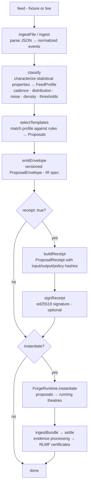
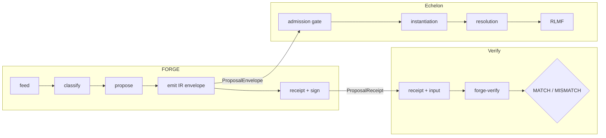
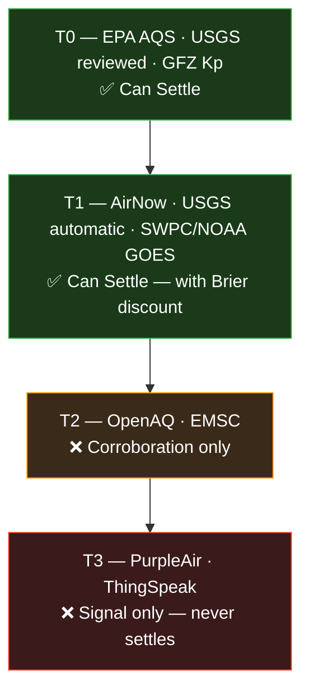

# FORGE

**Feed-Adaptive Oracle & Runtime Generator**

FORGE is Echelon's automatic Theatre Factory — the feed-native supply side that turns any structured event stream into prediction market proposals without human curation. It classifies live data across five statistical dimensions, selects from six theatre templates, and emits versioned ProposalEnvelopes that Echelon's admission gate consumes directly. Domain expertise encoded once, applied everywhere.

> The Uniswap factory for prediction surfaces.

FORGE is not one of many possible Theatre Factory inputs. It is the specific component that makes the factory automatic — covering domains where statistical structure in live data is the only reliable signal and where human language is inadequate as a classification tool. Three validated backing specs (TREMOR: seismic, CORONA: space weather, BREATH: air quality), 20.5/20.5 convergence on raw and anonymized fixtures, 699 tests, zero external dependencies.

v0.3.0 adds **ProposalReceipt v0** — a signed, independently verifiable proof that a given proposal envelope was produced from a specific input under a specific policy and code version. Ed25519 signing, JCS-subset canonicalization, and the `forge-verify` replay verifier CLI.

---

## Quick Start

```js
import { ForgeConstruct } from './src/index.js';

const forge = new ForgeConstruct();

// Fixture analysis — returns proposals + IR envelope
const result = await forge.analyze('fixtures/usgs-m4.5-day.json', {
  feed_id: 'usgs_m4.5_day',
  source_metadata: { source_id: 'usgs_automatic', trust_tier: 'T1', domain: 'seismic' },
});

console.log(result.envelope);   // Versioned ProposalEnvelope (spec/proposal-ir.json)
console.log(result.proposals);  // Raw proposals array

// With ProposalReceipt — signed proof of deterministic output
// Production: sign with ed25519 key (see docs/key-management.md)
// Dev/test: omit `sign` to generate unsigned receipts for local verification
const signed = await forge.analyze('fixtures/usgs-m4.5-day.json', {
  feed_id: 'usgs_m4.5_day',
  source_metadata: { source_id: 'usgs_automatic', trust_tier: 'T1', domain: 'seismic' },
  receipt: true,
  sign: signReceipt,            // ed25519 — see docs/key-management.md
});

console.log(signed.envelope);   // ProposalEnvelope (same as above)
console.log(signed.receipt);    // ProposalReceipt (spec/receipt-v0.json)

// With theatre lifecycle — instantiate running theatres from proposals
const live = await forge.analyze('fixtures/usgs-m4.5-day.json', {
  feed_id: 'usgs_m4.5_day',
  instantiate: true,
});

console.log(live.theatre_ids);                    // Created theatre IDs
console.log(forge.getRuntime().getState());       // Runtime state
console.log(forge.getCertificates());             // RLMF certificates after resolution
```

## Pipeline



## The Seam

FORGE is data-pure. It owns everything up to the **Proposal IR envelope** — classification, template selection, evidence bundle assembly, theatre lifecycle, RLMF certificate export, and (optionally) ProposalReceipt generation with ed25519 signing.

It does not handle market execution, liquidity, agent logic, or on-chain settlement. Integration with Echelon occurs via the `ProposalEnvelope` contract defined in `spec/proposal-ir.json`. FORGE emits; Echelon's admission gate consumes. Receipts provide an independent verification path via `forge-verify`.



## Requirements

- Node.js ≥ 20
- **Zero external dependencies** — no `npm install` required. Auditable, supply-chain-safe core. Classification is deterministic and side-effect free.

## Installation

```bash
git clone https://github.com/0xElCapitan/forge.git
cd forge
# No npm install needed — zero deps
```

## Tests

```bash
# Unit tests (684 tests)
npm run test:unit

# Convergence tests — TREMOR, CORONA, BREATH backing specs
npm test

# Everything (699 tests — unit + convergence + integration)
npm run test:all
```

## Modules

| Module | Description |
|--------|-------------|
| `src/index.js` | `ForgeConstruct` entrypoint + all granular exports |
| `src/ingester/` | Feed ingestion — JSON fixture → normalized event array |
| `src/classifier/` | Feed grammar — cadence, distribution, noise, density, thresholds |
| `src/selector/` | Template selection rules |
| `src/processor/` | EvidenceBundle assembly, quality scoring, doubt pricing |
| `src/trust/` | Oracle trust tiers (T0–T3), adversarial detection |
| `src/rlmf/` | Brier scoring, RLMF certificate export |
| `src/filter/` | Economic usefulness scoring |
| `src/composer/` | Temporal feed alignment and causal ordering |
| `src/replay/` | Deterministic replay for convergence testing |
| `src/ir/` | Proposal IR envelope emitter — the Echelon integration boundary |
| `src/receipt/` | ProposalReceipt — canonicalization, hashing, signing, verification |
| `src/runtime/` | ForgeRuntime — theatre lifecycle orchestrator |
| `src/adapter/` | Live feed adapters (USGS seismic) |
| `src/theatres/` | Theatre templates — threshold_gate, cascade, divergence, regime_shift, anomaly, persistence |
| `bin/` | `forge-verify` — independent replay verifier CLI |
| `spec/` | Proposal IR JSON Schema, Receipt v0 schema, construct spec |

## Granular Exports

Every sub-module is exported individually for testing, debugging, and the convergence loop:

```js
import {
  // Ingester
  ingest, ingestFile,

  // Classifier
  classify, classifyCadence, classifyDistribution,
  classifyNoise, classifyDensity, classifyThresholds,

  // Selector
  selectTemplates, evaluateRule, RULES,

  // Processor
  buildBundle, computeQuality, computeDoubtPrice,
  assignEvidenceClass, canSettleByClass,

  // Trust
  getTrustTier, canSettle, validateSettlement,
  checkAdversarial, checkChannelConsistency,

  // RLMF
  exportCertificate, brierScoreBinary, brierScoreMultiClass,

  // Filter
  computeUsefulness,

  // Composer
  alignFeeds, detectCausalOrdering, proposeComposedTheatre,

  // Replay
  createReplay,

  // IR
  emitEnvelope,

  // Runtime
  ForgeRuntime,

  // Theatres
  createThresholdGate, processThresholdGate, expireThresholdGate, resolveThresholdGate,
  createCascade, processCascade, expireCascade, resolveCascade,
  createDivergence, processDivergence, expireDivergence, resolveDivergence,
  createRegimeShift, processRegimeShift, expireRegimeShift, resolveRegimeShift,
  createAnomaly, processAnomaly, expireAnomaly, resolveAnomaly,
  createPersistence, processPersistence, expirePersistence, resolvePersistence,

  // Adapter
  USGSLiveAdapter, classifyUSGSFeed,
} from './src/index.js';

// Receipt internals (not re-exported — used via analyze({ receipt: true }) or forge-verify)
import { canonicalize }     from './src/receipt/canonicalize.js';
import { sha256 }           from './src/receipt/hash.js';
import { buildReceipt }     from './src/receipt/receipt-builder.js';
import { signReceipt, verifySignature } from './src/receipt/sign.js';
import { loadKeyring, getPublicKey }    from './src/receipt/keyring.js';
import { getCodeIdentity }  from './src/receipt/code-identity.js';
import { computePolicyHash } from './src/receipt/policy-hasher.js';
```

## Proposal IR

FORGE emits versioned `ProposalEnvelope` objects conforming to `spec/proposal-ir.json`. Each envelope contains the full feed classification, annotated proposals with deterministic `proposal_id` for idempotent dedup, and optional usefulness scores.

```js
import { emitEnvelope } from './src/index.js';

const envelope = emitEnvelope({
  feed_id: 'usgs_m4.5_day',
  feed_profile,
  proposals,
  source_metadata: { source_id: 'usgs_automatic', trust_tier: 'T1', domain: 'seismic' },
  score_usefulness: true,
});

// envelope.ir_version     → '0.1.0'
// envelope.proposals[0].proposal_id → deterministic SHA-256 hash (dedup key)
// envelope.proposals[0].brier_type  → 'binary' | 'multi_class'
// envelope.usefulness_scores        → { '0': 0.82, '1': 0.71, ... }
```

## ProposalReceipt

A ProposalReceipt is a signed proof that a specific ProposalEnvelope was produced from a specific input, under a specific policy configuration and code version. It enables independent verification without trusting the FORGE operator.

```js
const result = await forge.analyze('fixtures/usgs-m4.5-day.json', {
  feed_id: 'usgs_m4.5_day',
  source_metadata: { source_id: 'usgs_automatic', trust_tier: 'T1', domain: 'seismic' },
  receipt: true,
  timestampBase: 1700000000000,  // deterministic ingestion
  now: 1700000000000,            // deterministic envelope timestamp
  sign: mySigningFunction,       // ed25519 — see docs/key-management.md
});

// result.receipt:
// {
//   schema: 'forge-receipt/v0',
//   input_hash: 'sha256:abc...',        // hash of canonicalized raw input
//   code_version: { git_sha: 'abc...', package_lock_sha: null, node_version: '20.11.0' },
//   policy_hash: 'sha256:def...',       // hash of rules + regulatory tables
//   output_hash: 'sha256:789...',       // hash of canonicalized envelope
//   signer: 'forge-production',
//   key_id: 'forge-production-001',
//   signature: 'ed25519:...',           // base64 ed25519 signature
//   computed_at: '2023-11-14T...',
// }
```

Receipt schema: `spec/receipt-v0.json`. Canonicalization: JCS-subset/v0 (see `docs/canonicalization.md`). Key management: `docs/key-management.md`. Retention: `docs/retention-policy.md`.

## forge-verify

Independent replay verifier CLI. Re-runs the FORGE pipeline on the original input and compares the output hash against the receipt.

```bash
# Verify a receipt against its original input
node bin/forge-verify.js receipt.json --input input.json

# Verbose mode — shows intermediate hashes
node bin/forge-verify.js receipt.json --input input.json --verbose

# Direct envelope verification (no receipt file needed)
node bin/forge-verify.js --envelope envelope.json --input input.json
```

Exit codes: `0` = MATCH, `1` = MISMATCH, `2` = ERROR.

Echelon integration: `forge-verify` maps to a future `echelon-verify forge` subcommand at the admission gate. See `docs/echelon-integration.md`.

## Trust Tiers



## RLMF Certificates

After a theatre resolves, export a training certificate:

```js
import { exportCertificate, brierScoreBinary } from './src/index.js';

const cert = exportCertificate(theatre, { theatre_id: 'th-001' });
// {
//   theatre_id: 'th-001',
//   template: 'threshold_gate',
//   brier_score: 0.04,       // (0.8 - 1)² — lower is better
//   outcome: true,
//   final_probability: 0.8,
//   position_history: [...],
//   ...
// }
```

## Economic Usefulness

Score a proposal's economic viability before deployment:

```js
import { computeUsefulness } from './src/index.js';

const score = computeUsefulness(proposal, feedProfile, { source_tier: 'T1' });
// 0–1: population_impact × regulatory_relevance × predictability × actionability
```

## Backing Specs

Convergence is validated against three real-world constructs:

| Spec | Domain | Fixtures |
|------|--------|----------|
| TREMOR | USGS seismic | `fixtures/usgs-m4.5-day.json` |
| CORONA | NOAA/NASA space weather | `fixtures/swpc-goes-xray.json`, `fixtures/donki-flr-cme.json` |
| BREATH | PurpleAir/AirNow air quality | `fixtures/purpleair-sf-bay.json`, `fixtures/airnow-sf-bay.json` |

**Target**: 20.5/20.5 TotalScore (13.0 TemplateScore + 7.5 GrammarScore) on raw and anonymized fixtures. ✅ Achieved.

## Golden Envelopes

Real `forge.analyze()` IR output for each backing spec, used by Echelon's bridge tests:

| File | Domain | Proposals |
|------|--------|-----------|
| `fixtures/forge-snapshots-tremor.json` | Seismic | 5 proposals |
| `fixtures/forge-snapshots-corona.json` | Space weather | 5 proposals |
| `fixtures/forge-snapshots-breath.json` | Air quality | 1 proposal |

## Documentation

| Document | Description |
|----------|-------------|
| `docs/canonicalization.md` | JCS-subset/v0 canonical JSON spec |
| `docs/key-management.md` | Ed25519 key format, rotation, environment variables |
| `docs/retention-policy.md` | 90-day retention window, git-retained vs caller-retained |
| `docs/echelon-integration.md` | Admission gate integration path for receipts |

## License

AGPL-3.0
