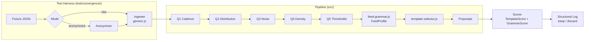
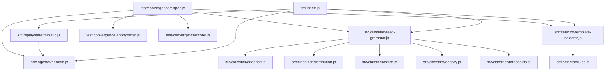

# FORGE — Software Design Document

> **Status**: Active
> **Version**: 1.0.0
> **Date**: 2026-03-19
> **PRD**: grimoires/loa/prd.md

---

## 1. Executive Summary

FORGE is a pure Node.js 20+ library — no server, no UI, no HTTP API. It is a pipeline:

```
raw fixture → ingester → classifier → selector → proposals
```

The two moving parts that the convergence loop iterates on are the **classifier** (Q1-Q5) and the **selector** (rules + ranker). Everything else is infrastructure built once. The convergence test harness drives the loop: run tests, score proposals against backing specs, keep or discard. The pipeline terminates in a structured log per iteration that serves as the gradient signal.

**Critical constraint**: The ingester is the anti-cheating enforcement boundary. It receives raw JSON (potentially anonymized) and emits `NormalizedEvent[]` with all source identity stripped. The classifier sees only normalized tuples — never field names, domain strings, or source URLs.

---

## 2. System Architecture

### 2.1 High-Level Pipeline



### 2.2 Module Dependency Graph



### 2.3 Zone Map

| Zone | Path | Ownership | Mutability |
|------|------|-----------|------------|
| Fixtures | `fixtures/` | FIXED | Never modified post-fetch |
| Test harness | `test/convergence/` | FIXED | Set up once in Phase 0 |
| Classifier | `src/classifier/` | AGENT | The loop target — iterate freely |
| Selector | `src/selector/` | AGENT | Loop target after Phase 1 converges |
| Infrastructure | `src/replay/`, `src/ingester/`, `src/processor/`, `src/theatres/`, `src/trust/`, `src/filter/`, `src/composer/`, `src/rlmf/`, `src/index.js` | BUILD ONCE | After convergence, standard Loa workflow |

---

## 3. Technology Stack

| Component | Choice | Version | Justification |
|-----------|--------|---------|---------------|
| Runtime | Node.js | 20.x LTS | Built-in `fetch`, `node:test`, ESM. No external deps. Matches TREMOR/CORONA/BREATH. |
| Module system | ES Modules | ESM | TREMOR/CORONA/BREATH all use `import/export`. Matches construct ecosystem. |
| Test runner | `node:test` | built-in | Zero dependency, deterministic, matches `node --test` convention. |
| Assertion | `node:assert` | built-in | Strict mode assertions. `assert.strictEqual`, `assert.deepStrictEqual`. |
| Signal processing | Custom (vanilla JS) | — | FFT for Q3 cyclical detection. Rolling statistics for spike detection. Pure JS, no numpy/mathjs. |
| Package manager | npm | — | Lockfile only for dev tooling (none in production). |

**Zero external runtime dependencies.** `package.json` will have no `dependencies` — only `devDependencies` if any (none planned). `"type": "module"`.

---

## 4. Data Architecture

### 4.1 Core Types (JSDoc-annotated)

#### NormalizedEvent

The anti-cheating boundary. All source identity stripped. This is what the classifier sees.

```js
/**
 * @typedef {Object} NormalizedEvent
 * @property {number} timestamp - Unix epoch milliseconds
 * @property {number} value     - Primary observable (dimensionless — unit stripped)
 * @property {number} [value_2] - Secondary observable for composite feeds
 * @property {Object} metadata
 * @property {number} metadata.sensor_count - Number of contributing sensors (1 if unknown)
 * @property {Array<{lat: number, lon: number}>} [metadata.coordinates] - Spatial positions
 * @property {string[]} metadata.value_labels - Generic: ['reading_1', 'reading_2']
 *
 * MUST NOT contain: field names from source, source URLs, domain strings,
 * unit strings, source identifiers, API paths, sensor model names.
 */
```

#### FeedProfile

Output of the classifier. Input to the selector.

```js
/**
 * @typedef {Object} FeedProfile
 * @property {CadenceProfile}      cadence
 * @property {DistributionProfile} distribution
 * @property {NoiseProfile}        noise
 * @property {DensityProfile}      density
 * @property {ThresholdProfile}    thresholds
 */

/**
 * @typedef {Object} CadenceProfile
 * @property {'seconds'|'minutes'|'hours'|'days'|'event_driven'|'multi_cadence'} classification
 * @property {number}   median_ms
 * @property {number}   [jitter_coefficient]  - stdev/median of deltas
 * @property {string[]} [streams]             - for multi_cadence, e.g. ['120s', '60min']
 */

/**
 * @typedef {Object} DistributionProfile
 * @property {'bounded_numeric'|'unbounded_numeric'|'categorical'|'composite'} type
 * @property {{min: number, max: number}} [bounds]
 * @property {string[]} [sub_types]           - for composite
 */

/**
 * @typedef {Object} NoiseProfile
 * @property {'spike_driven'|'cyclical'|'trending'|'stable_with_drift'|'mixed'} classification
 * @property {number}   [spike_rate]
 * @property {number}   [lag1_autocorr]
 * @property {string[]} [components]          - for mixed: ['cyclical', 'spike_driven']
 */

/**
 * @typedef {Object} DensityProfile
 * @property {'single_point'|'sparse_network'|'dense_network'|'multi_tier'} classification
 * @property {number}   [sensor_count]
 * @property {number}   [mean_nn_distance_km]
 * @property {string[]} [tiers]
 */

/**
 * @typedef {Object} ThresholdProfile
 * @property {'regulatory'|'physical'|'statistical'|'none'} type
 * @property {number[]} [values]              - candidate gate thresholds
 * @property {string}   [regulatory_table]   - matched table name if regulatory
 */
```

#### Rule

Enforced schema — no inline logic, no anonymous rules.

```js
/**
 * @typedef {Object} RuleCondition
 * @property {string} field     - dot-path into FeedProfile, e.g. "noise.classification"
 * @property {'equals'|'in'|'gt'|'lt'|'gte'|'lte'|'contains'} operator
 * @property {*}      value
 */

/**
 * @typedef {Object} Rule
 * @property {string}          id         - e.g. "rule_001"
 * @property {RuleCondition[]} conditions
 * @property {{template: string, params: Object}} output
 * @property {string}          confidence  - formula string (documentation only)
 * @property {string}          traced_to   - e.g. "TREMOR MagGate, CORONA FlareGate"
 */
```

#### Proposal

Output of the selector.

```js
/**
 * @typedef {Object} Proposal
 * @property {string}   template    - 'threshold_gate' | 'cascade' | 'divergence' | ...
 * @property {Object}   params      - template-specific params (threshold, window_hours, etc.)
 * @property {number}   confidence  - 0.0-1.0, mechanical: conditions_met / conditions_total
 * @property {string}   rationale   - human-readable explanation
 * @property {string[]} rule_ids    - rules that fired to produce this proposal
 */
```

#### StructuredLog

Emitted by the test harness every iteration.

```js
/**
 * @typedef {Object} StructuredLog
 * @property {number}     iteration
 * @property {string}     feed          - fixture name
 * @property {FeedProfile} feed_profile
 * @property {Object[]}   rules_evaluated
 * @property {string}     rules_evaluated[].id
 * @property {number}     rules_evaluated[].conditions_met
 * @property {number}     rules_evaluated[].conditions_total
 * @property {boolean}    rules_evaluated[].fired
 * @property {string}     [rules_evaluated[].failed_condition]
 * @property {Proposal[]} proposals
 * @property {Object}     score
 * @property {number}     score.template_score
 * @property {number}     score.grammar_score
 * @property {number}     score.total
 * @property {number}     delta         - vs previous iteration
 * @property {'keep'|'discard'} decision
 */
```

### 4.2 Regulatory Tables

Q5 threshold detection requires comparing histogram breakpoints against known regulatory tables. These are static data files — not hardcoded in classifier logic.

```
src/classifier/data/
├── regulatory-epa-aqi.json    # AQI breakpoints: [0, 51, 101, 151, 201, 301, 500]
├── regulatory-noaa-kp.json    # Kp G-scale: [5, 6, 7, 8, 9] → G1-G5
└── regulatory-noaa-r.json     # Radio blackout scale: R1-R5
```

The Q5 classifier loads these at startup and matches feed value histograms against them. The table match itself is statistical (density clustering), not a field-name lookup.

---

## 5. Component Design

### 5.1 Ingester (`src/ingester/generic.js`)

**Purpose**: Convert raw JSON (or anonymized JSON) into `NormalizedEvent[]`. This is the anti-cheating enforcement point.

**Critical invariant**: The ingester must produce identical `NormalizedEvent[]` for both raw and anonymized input, up to field renaming. The classifier downstream must produce identical `FeedProfile` from both.

#### Structural Inference Strategy

The ingester cannot hardcode field names. It must infer structure:

| Target | Detection Strategy |
|--------|-------------------|
| **Timestamp** | Value matches ISO8601 pattern OR large integer > 1e12 (Unix ms) OR integer in [1e9, 1e12] (Unix s) |
| **Primary value** | Numeric non-timestamp field. If multiple candidates: highest-variance field wins (most informative) |
| **Coordinates** | Two numeric fields where one is in [-90, 90] (lat) and other in [-180, 180] (lon). Requires co-occurrence. |
| **Sensor count** | Array length (if input is array of sensors). Or explicit count-like field (heuristic: integer field with low variance and value > 0) |

#### Format Normalization

The ingester handles three structural shapes from the known fixture formats:

| Shape | Pattern | Example |
|-------|---------|---------|
| **GeoJSON FeatureCollection** | `{ type: "FeatureCollection", features: [...] }` | USGS seismic |
| **JSON array of objects** | `[{time_tag, value, ...}, ...]` | SWPC X-ray flux, Kp |
| **JSON array of arrays** | `[[header_row], [data_row], ...]` | SWPC Kp (row format) |

Detection: structural pattern matching on the root value, without reading field names. The ingester identifies the shape, then applies the appropriate extraction strategy.

**Important**: In anonymized mode, the field name `time_tag` becomes something like `field_xk3p`. The timestamp detection still works because the value `"2024-01-15T12:30:00Z"` is still an ISO8601 string. The value detection works because the magnitude/flux/AQI value is still a number with high variance.

#### Function Signature

```js
/**
 * Ingest raw (or anonymized) fixture data into NormalizedEvent[].
 *
 * @param {Object|Array} rawData - Parsed JSON from fixture
 * @param {Object} [options]
 * @param {boolean} [options.multiStream=false] - Treat input as composite (CORONA multi-feed)
 * @returns {NormalizedEvent[]} Sorted by timestamp ascending
 */
export function ingest(rawData, options = {}) { }

/**
 * Ingest from a file path (used by replay module).
 *
 * @param {string} filePath - Path to fixture JSON file
 * @param {Object} [options]
 * @returns {Promise<NormalizedEvent[]>}
 */
export async function ingestFile(filePath, options = {}) { }
```

### 5.2 Replay Module (`src/replay/deterministic.js`)

**Purpose**: Present a fixture JSON file as if it were a live feed stream. Deterministic — same fixture, same output, every time.

```js
/**
 * Create a deterministic replay from a fixture file.
 *
 * @param {string} fixturePath
 * @param {Object} [options]
 * @param {number} [options.speedFactor=1] - 1 = realtime, 0 = instant (all at once)
 * @returns {AsyncIterable<NormalizedEvent>} Events in timestamp order
 */
export function createReplay(fixturePath, options = {}) { }
```

For convergence tests, `speedFactor=0` (instant replay) is used — all events delivered immediately.

### 5.3 Classifier (`src/classifier/`)

All classifier functions are **pure** — no I/O, no state, no side effects. Given identical input, they return identical output.

#### Q1: Cadence (`cadence.js`)

```js
/**
 * @param {NormalizedEvent[]} events - must have >= 2 events
 * @returns {CadenceProfile}
 */
export function classifyCadence(events) { }

// Internals:
// - computeDeltas(events) → number[]   (consecutive timestamp differences in ms)
// - computeMedian(deltas) → number
// - computeJitterCoefficient(deltas) → number   (stdev/median)
// - detectBimodal(deltas) → { isBimodal: boolean, peaks: number[] }
```

#### Q2: Distribution (`distribution.js`)

```js
/**
 * @param {NormalizedEvent[]} events
 * @returns {DistributionProfile}
 */
export function classifyDistribution(events) { }

// Internals:
// - computeBounds(values) → { min, max }
// - computePercentiles(values, ps) → number[]
// - detectUnboundedGrowth(values) → boolean   (rolling max sub-window coefficient)
// - detectCategorical(values) → boolean
// - detectMultimodal(values) → boolean   (for composite detection)
```

#### Q3: Noise (`noise.js`)

```js
/**
 * @param {NormalizedEvent[]} events
 * @returns {NoiseProfile}
 */
export function classifyNoise(events) { }

// Internals:
// - computeSpikes(values) → { spike_rate, spike_indices }
// - computeLag1Autocorr(values) → number
// - computeDominantFFTFreq(values) → { freq, power, next_peak_power }
// - computeLinearTrendTStat(values) → number   (t-statistic of regression slope)
// - computeRollingStats(values, window) → { stdev, mean }[]
```

**FFT implementation note**: Use a vanilla JS DFT for small windows (N ≤ 512). For larger N, Cooley-Tukey FFT implemented in pure JS. No external library. Input: evenly-sampled value sequence (interpolated if needed from irregular timestamps).

#### Q4: Density (`density.js`)

```js
/**
 * @param {NormalizedEvent[]} events
 * @returns {DensityProfile}
 */
export function classifyDensity(events) { }

// Internals:
// - extractSensorCount(events) → number
// - extractCoordinates(events) → Array<{lat, lon}>
// - computeMeanNearestNeighbor(coords) → number   (km, Haversine)
// - computeCoLocatedPairs(coords, threshold_km=1) → number
// - detectMultiTier(events) → boolean   (cadence variance or quality bimodal)
```

#### Q5: Thresholds (`thresholds.js`)

```js
/**
 * @param {NormalizedEvent[]} events
 * @param {Object} [regulatoryTables]  - loaded from src/classifier/data/
 * @returns {ThresholdProfile}
 */
export function classifyThresholds(events, regulatoryTables = {}) { }

// Internals:
// - computeHistogram(values, bins=50) → { bins, counts }
// - detectBreakpoints(histogram) → number[]   (sharp density change points)
// - matchRegulatoryTable(breakpoints, tables) → { matched: boolean, table: string }
// - detectBimodalSeparation(values) → { bimodal: boolean, boundary: number }
// - computePercentileThresholds(values) → { p95, p99, sigma3 }
```

#### Feed Grammar Orchestrator (`feed-grammar.js`)

```js
/**
 * Run Q1-Q5 on a set of normalized events and produce a FeedProfile.
 *
 * @param {NormalizedEvent[]} events
 * @param {Object} [options]
 * @param {Object} [options.regulatoryTables] - pre-loaded regulatory data
 * @returns {FeedProfile}
 */
export function classify(events, options = {}) {
  return {
    cadence:      classifyCadence(events),
    distribution: classifyDistribution(events),
    noise:        classifyNoise(events),
    density:      classifyDensity(events),
    thresholds:   classifyThresholds(events, options.regulatoryTables),
  };
}
```

### 5.4 Selector (`src/selector/`)

#### Rules (`rules.js`)

The rule list is a static array export. No logic — just data.

```js
// src/selector/rules.js
export const RULES = [
  {
    id: 'rule_001',
    conditions: [
      { field: 'noise.classification', operator: 'equals', value: 'spike_driven' },
      { field: 'distribution.type', operator: 'equals', value: 'unbounded_numeric' },
      { field: 'thresholds.type', operator: 'in', value: ['statistical', 'physical'] },
    ],
    output: {
      template: 'threshold_gate',
      params: {
        threshold: 'thresholds.values[percentile_95]',
        window_hours: 'cadence.median_ms * 240 / 3600000',
        base_rate: 0.10,
      },
    },
    confidence: 'conditions_satisfied / conditions_total',
    traced_to: 'TREMOR MagGate, CORONA FlareGate',
  },
  // ... more rules
];
```

The `traced_to` field is required. A rule without a backing construct reference is invalid.

#### Template Selector (`template-selector.js`)

```js
/**
 * Evaluate all rules against a FeedProfile and produce ranked proposals.
 *
 * @param {FeedProfile} profile
 * @param {Rule[]} [rules] - defaults to RULES from rules.js
 * @returns {{ proposals: Proposal[], rules_evaluated: RuleEvaluation[] }}
 */
export function selectTemplates(profile, rules = RULES) { }

/**
 * Evaluate a single rule against a profile.
 * Returns { conditions_met, conditions_total, confidence, fired }.
 *
 * @param {FeedProfile} profile
 * @param {Rule} rule
 * @returns {RuleEvaluation}
 */
export function evaluateRule(profile, rule) { }

/**
 * Get nested value from FeedProfile using dot-path notation.
 * e.g., getField(profile, "noise.classification") → "spike_driven"
 *
 * @param {FeedProfile} profile
 * @param {string} fieldPath
 * @returns {*}
 */
export function getField(profile, fieldPath) { }
```

#### Tie-breaking (deterministic)
1. Higher confidence (float, 0.0-1.0)
2. More conditions (specificity)
3. `traced_to` backing-construct count (split by `,`, count unique constructs)
4. Lexical rule ID (`rule_001` < `rule_002`)

### 5.5 Test Harness (`test/convergence/`)

The test harness owns scoring, anonymization, and the convergence assertions. These files are FIXED after Phase 0.

#### Anonymizer (`test/convergence/anonymizer.js`)

```js
/**
 * Anonymize a raw fixture JSON for anti-cheating validation.
 *
 * - Shuffles all field names to random 6-char strings (seeded, deterministic per fixture)
 * - Strips source URLs, domain names, API paths from string values
 * - Preserves numeric values, timestamps, array structure
 *
 * @param {*} rawData - parsed fixture JSON
 * @param {string} seed - deterministic seed for shuffle (use fixture filename)
 * @returns {*} anonymized JSON with same structure but renamed keys
 */
export function anonymize(rawData, seed) { }
```

The seed ensures anonymization is deterministic: the same fixture always gets the same key names (e.g., `mag` always becomes `field_xk3p` for the USGS fixture). This makes failures reproducible.

#### Scorer (`test/convergence/scorer.js`)

```js
/**
 * Score proposals against a backing spec.
 *
 * @param {Proposal[]} proposals
 * @param {BackingSpec} backingSpec
 * @returns {{ template_score: number, grammar_score: number, total: number, details: Object[] }}
 */
export function score(proposals, profile, backingSpec) { }

/**
 * Match proposals to expected templates using greedy max-overlap assignment.
 * Each proposal assigned to at most one expected template.
 *
 * @param {Proposal[]} proposals
 * @param {Object[]} expectedTemplates
 * @returns {Array<{ expected, proposed, overlap, score }>}
 */
export function matchTemplates(proposals, expectedTemplates) { }
```

#### Spec Files (`tremor.spec.js`, `corona.spec.js`, `breath.spec.js`)

Each spec:
1. Loads fixture from `fixtures/`
2. Runs `ingest(rawData)` → `NormalizedEvent[]`
3. Runs `classify(events)` → `FeedProfile`
4. Runs `selectTemplates(profile)` → `Proposal[]`
5. Scores against backing spec
6. Emits structured log
7. Asserts `total >= threshold` (threshold starts at 0, increments as score improves)
8. Repeats in anonymized mode

```js
// test/convergence/tremor.spec.js — structure
import { describe, it } from 'node:test';
import assert from 'node:assert/strict';
import { ingestFile } from '../../src/ingester/generic.js';
import { classify } from '../../src/classifier/feed-grammar.js';
import { selectTemplates } from '../../src/selector/template-selector.js';
import { score } from './scorer.js';
import { anonymize } from './anonymizer.js';
import { TREMOR_BACKING_SPEC } from './specs/tremor-spec.js';

const FIXTURE = 'fixtures/usgs-m4.5-day.json';
const ITERATION = parseInt(process.env.FORGE_ITERATION ?? '0');

describe('TREMOR convergence', () => {
  it('raw mode', async () => {
    const events = await ingestFile(FIXTURE);
    const profile = classify(events);
    const { proposals, rules_evaluated } = selectTemplates(profile);
    const result = score(proposals, profile, TREMOR_BACKING_SPEC);
    console.log(JSON.stringify({ iteration: ITERATION, feed: 'tremor', mode: 'raw', ...result }));
    assert.ok(result.total >= 0); // threshold rises over iterations
  });

  it('anonymized mode', async () => {
    const raw = JSON.parse(await fs.readFile(FIXTURE, 'utf-8'));
    const anon = anonymize(raw, 'tremor');
    const events = ingest(anon);
    const profile = classify(events);
    const { proposals } = selectTemplates(profile);
    const result = score(proposals, profile, TREMOR_BACKING_SPEC);
    console.log(JSON.stringify({ iteration: ITERATION, feed: 'tremor', mode: 'anonymized', ...result }));
    // CRITICAL: must match raw mode score (within tolerance)
    assert.ok(result.total >= 0);
  });
});
```

### 5.6 Fixture Acquisition Script

The `fixtures/` directory is empty. Phase 0 includes a one-time fetch script:

```
scripts/fetch-fixtures.sh  (NOT part of agent-modifiable code)
```

This script:
1. Fetches `https://earthquake.usgs.gov/earthquakes/feed/v1.0/summary/4.5_day.geojson` → `fixtures/usgs-m4.5-day.json`
2. Fetches SWPC X-ray 6-hour + Kp observed feeds → `fixtures/swpc-goes-xray.json`
3. Fetches DONKI FLR + CME (7-day) → `fixtures/donki-flr-cme.json`
4. Fetches PurpleAir SF Bay bbox (requires `PURPLEAIR_API_KEY`) → `fixtures/purpleair-sf-bay.json`
5. Fetches AirNow SF Bay (requires `AIRNOW_API_KEY`) → `fixtures/airnow-sf-bay.json`

Once fetched and committed, fixtures are frozen. The loop always runs against these snapshots.

> [ASSUMPTION] PurpleAir and AirNow API keys are obtainable. If not, synthetic fixtures matching the expected format can be hand-crafted as an alternative.

---

## 6. API Specifications (Library API)

FORGE exposes no HTTP API. The public library interface is:

### 6.1 `src/index.js` — ForgeConstruct

```js
/**
 * ForgeConstruct — entrypoint for the FORGE pipeline.
 *
 * Usage:
 *   import { ForgeConstruct } from './src/index.js';
 *   const forge = new ForgeConstruct();
 *   const result = await forge.analyze(fixturePath);
 */
export class ForgeConstruct {
  /**
   * Analyze a feed (from file or live) and return proposals.
   *
   * @param {string} source - File path OR live feed URL
   * @param {Object} [options]
   * @param {Object} [options.regulatoryTables] - override default tables
   * @returns {Promise<ForgeResult>}
   */
  async analyze(source, options = {}) { }

  /**
   * Get all exported RLMF certificates.
   * @returns {RLMFCertificate[]}
   */
  getCertificates() { }
}

/**
 * @typedef {Object} ForgeResult
 * @property {FeedProfile}  feed_profile
 * @property {Proposal[]}   proposals
 * @property {StructuredLog} log
 */
```

### 6.2 Granular Exports (for testing and debugging)

```js
// Ingester
export { ingest, ingestFile } from './ingester/generic.js';

// Classifier
export { classify }               from './classifier/feed-grammar.js';
export { classifyCadence }        from './classifier/cadence.js';
export { classifyDistribution }   from './classifier/distribution.js';
export { classifyNoise }          from './classifier/noise.js';
export { classifyDensity }        from './classifier/density.js';
export { classifyThresholds }     from './classifier/thresholds.js';

// Selector
export { selectTemplates, evaluateRule } from './selector/template-selector.js';
export { RULES }                        from './selector/rules.js';

// Replay
export { createReplay } from './replay/deterministic.js';
```

---

## 7. Security Architecture

FORGE ingests live public data feeds (in production). Relevant threat surface:

| Threat | Mitigation |
|--------|-----------|
| **Adversarial feed data** (T2/T3 source manipulation) | Anti-gaming module (`adversarial.js`): detect location spoofing, value manipulation, replayed data, Sybil sensors. PurpleAir channel A/B consistency as reference design. |
| **Trust tier escalation** | T3 → T2 promotion requires: min observation count + uptime % + neighborhood agreement + anti-spoof checks. Never T0/T1 without explicit human override. |
| **Settlement authority spoofing** | `oracle-trust.js` enforces: only T0/T1 sources may settle. PurpleAir (T3) may never settle a theatre. Enforced at bundle processing time, not proposal time. |
| **Classification cheating** | Anonymized fixture mode is the enforcement test. If raw passes but anonymized fails, the classifier is rejected. |
| **Replay attacks** | Deterministic dedup by `{id}-{updated}` key (seismic) or `{event_id}-{status}` (other feeds). |
| **Clock drift** | Ingester validates `timestamp` is within reasonable range. Events > 7 days old or > 1 hour future are flagged. |

---

## 8. Error Handling Strategy

### Ingester
- Unknown fixture format → throw `IngestError('unrecognized_structure')` with shape description
- No timestamp detected → throw `IngestError('no_timestamp_detected')`
- No numeric value detected → throw `IngestError('no_value_detected')`
- Empty result (0 events) → return `[]`, emit warning

### Classifier
- Fewer than 2 events for Q1 → return `{ classification: 'event_driven', median_ms: 0 }` (can't compute deltas)
- All identical values for Q2 → return `{ type: 'categorical' }` (zero variance = categorical)
- Fewer than 20 events for Q3 spike detection → reduce rolling window size proportionally
- No coordinates for Q4 → return `{ classification: 'single_point', sensor_count: 1 }`

### Selector
- No rules match (all confidence 0) → return `[]` proposals with empty rationale
- Rule references field path not in FeedProfile → `getField` returns `undefined`, condition fails (not an error)

### Test Harness
- Fixture file not found → fail fast with `Error('fixture not found: ...')`, no retry
- Score regression → structured log with `decision: 'discard'`, exit 1 (signals loop to revert)

---

## 9. Testing Strategy

### 9.1 Convergence Tests (Primary)

```bash
# Run all three backing spec convergence tests
node --test test/convergence/tremor.spec.js
node --test test/convergence/corona.spec.js
node --test test/convergence/breath.spec.js
```

Each test runs in both raw and anonymized mode. Both must pass for a keep decision.

### 9.2 Unit Tests (Per Q)

Each classifier question has isolated unit tests validating the measurable thresholds:

```bash
# Run all unit tests
node --test test/unit/cadence.spec.js
node --test test/unit/distribution.spec.js
node --test test/unit/noise.spec.js
node --test test/unit/density.spec.js
node --test test/unit/thresholds.spec.js
node --test test/unit/scorer.spec.js
node --test test/unit/anonymizer.spec.js
```

Unit tests use synthetic data where the expected classification is certain (e.g., perfectly regular deltas → `seconds`).

### 9.3 Rule Isolation Tests

Each rule is testable in isolation: given a FeedProfile, `evaluateRule(profile, rule)` must return expected `{conditions_met, confidence}`. These tests validate the decision tree without running the full pipeline.

### 9.4 Determinism Tests

For every spec file, run twice with identical input and assert outputs are identical. Node.js is deterministic for pure JS — this catches accidental use of `Math.random()` or `Date.now()`.

### 9.5 Post-Convergence Novel Tests

After 13/13 on all three backing specs:
- Loop 4: ThingSpeak temperature fixture (to be acquired separately)
- Loop 5: PurpleAir + wind direction composite fixture

---

## 10. Development Phases

### Phase 0 — Scaffolding (Sprint 1)

**Goal**: The loop can run. Convergence tests exist and can be executed (even if score = 0).

| Task | Output | Notes |
|------|--------|-------|
| `package.json` with `"type": "module"`, test scripts | `package.json` | No dependencies |
| Fixture fetch script | `scripts/fetch-fixtures.sh` | One-time execution |
| Fetch and commit fixtures | `fixtures/*.json` | FIXED after this point |
| `src/replay/deterministic.js` | Replay module | Instant replay for tests |
| `src/ingester/generic.js` | Generic ingester (structural inference) | Anti-cheating boundary |
| `test/convergence/anonymizer.js` | Anonymizer | Seeded deterministic key shuffle |
| `test/convergence/scorer.js` | Scorer | TemplateScore + GrammarScore |
| `test/convergence/specs/tremor-spec.js` | Backing spec for TREMOR | Extracted from PRD |
| `test/convergence/specs/corona-spec.js` | Backing spec for CORONA | Extracted from PRD |
| `test/convergence/specs/breath-spec.js` | Backing spec for BREATH | Extracted from PRD |
| `test/convergence/tremor.spec.js` | TREMOR convergence test | Dual mode |
| `test/convergence/corona.spec.js` | CORONA convergence test | Dual mode |
| `test/convergence/breath.spec.js` | BREATH convergence test | Dual mode |

**Sprint 1 done when**: `node --test test/convergence/tremor.spec.js` runs, produces structured log, scores 0/20.5.

### Phase 1 — Classifier (Sprints 2-6, iterative)

**Goal**: GrammarScore approaches 15/15. Each Q is a sprint.

| Sprint | Task | Expected score delta |
|--------|------|---------------------|
| Sprint 2 | Q1 Cadence | +5 GrammarScore (cadence classification matches all 3 specs) |
| Sprint 3 | Q2 Distribution | +5 GrammarScore |
| Sprint 4 | Q3 Noise | +5 GrammarScore → GrammarScore = 15/15 |
| Sprint 5 | Q4 Density | GrammarScore already full; begins enabling correct template proposals |
| Sprint 6 | Q5 Thresholds + regulatory tables | Enables threshold_gate params to be correct |

After each Q is added, run the convergence loop. Partial convergence is expected and diagnostic.

### Phase 2 — Selector (Sprints 7-9, iterative)

**Goal**: TemplateScore approaches 13/13. Each sprint adds or refines rules.

| Sprint | Task |
|--------|------|
| Sprint 7 | Initial rule set: threshold_gate and cascade rules for all three specs |
| Sprint 8 | Divergence and anomaly rules; false positive elimination |
| Sprint 9 | Regime shift and persistence rules; context param scoring |

After each rule set, run convergence tests. Structured log shows exactly which rules fired/failed for which templates.

### Phase 3 — Infrastructure (Sprints 10-14, standard /build)

**Goal**: Complete FORGE library ready for deployment. Standard Loa workflow (implement → review → audit).

| Sprint | Task |
|--------|------|
| Sprint 10 | Six theatre templates (extracted from TREMOR/CORONA/BREATH) |
| Sprint 11 | Generalized processor pipeline (quality, uncertainty, settlement, bundles) |
| Sprint 12 | Oracle trust model + adversarial detection |
| Sprint 13 | Economic usefulness filter + RLMF certificates |
| Sprint 14 | Composition layer + ForgeConstruct entrypoint |

---

## 11. File Structure

```
forge/
├── package.json                          # type: module, no runtime deps
├── fixtures/                             # FIXED — fetch once, never modify
│   ├── usgs-m4.5-day.json
│   ├── swpc-goes-xray.json
│   ├── donki-flr-cme.json
│   ├── purpleair-sf-bay.json
│   └── airnow-sf-bay.json
├── scripts/
│   └── fetch-fixtures.sh                 # One-time fixture acquisition
├── src/
│   ├── index.js                          # ForgeConstruct entrypoint
│   ├── classifier/
│   │   ├── feed-grammar.js               # Orchestrator — LOOP TARGET
│   │   ├── cadence.js                    # Q1 — LOOP TARGET
│   │   ├── distribution.js               # Q2 — LOOP TARGET
│   │   ├── noise.js                      # Q3 — LOOP TARGET
│   │   ├── density.js                    # Q4 — LOOP TARGET
│   │   ├── thresholds.js                 # Q5 — LOOP TARGET
│   │   └── data/
│   │       ├── regulatory-epa-aqi.json
│   │       ├── regulatory-noaa-kp.json
│   │       └── regulatory-noaa-r.json
│   ├── selector/
│   │   ├── template-selector.js          # LOOP TARGET
│   │   └── rules.js                      # LOOP TARGET
│   ├── ingester/
│   │   ├── generic.js                    # Anti-cheating boundary — FIXED
│   │   └── rate-limiter.js               # Live feed rate limiting
│   ├── replay/
│   │   └── deterministic.js              # Fixture replay — FIXED
│   ├── processor/
│   │   ├── quality.js
│   │   ├── uncertainty.js
│   │   ├── settlement.js
│   │   └── bundles.js
│   ├── theatres/
│   │   ├── threshold-gate.js
│   │   ├── cascade.js
│   │   ├── divergence.js
│   │   ├── regime-shift.js
│   │   ├── persistence.js
│   │   └── anomaly.js
│   ├── trust/
│   │   ├── oracle-trust.js
│   │   └── adversarial.js
│   ├── filter/
│   │   └── usefulness.js
│   ├── composer/
│   │   └── compose.js
│   └── rlmf/
│       └── certificates.js
└── test/
    ├── convergence/
    │   ├── tremor.spec.js                # FIXED
    │   ├── corona.spec.js                # FIXED
    │   ├── breath.spec.js                # FIXED
    │   ├── anonymizer.js                 # FIXED
    │   ├── scorer.js                     # FIXED
    │   └── specs/
    │       ├── tremor-spec.js            # Backing spec data — FIXED
    │       ├── corona-spec.js
    │       └── breath-spec.js
    └── unit/
        ├── cadence.spec.js
        ├── distribution.spec.js
        ├── noise.spec.js
        ├── density.spec.js
        ├── thresholds.spec.js
        ├── selector.spec.js
        ├── scorer.spec.js
        └── anonymizer.spec.js
```

---

## 12. Technical Risks & Mitigation

| Risk | Severity | Mitigation |
|------|----------|------------|
| **Anonymizer breaks ingester** — shuffled field names make timestamp/value detection fail | Critical | Unit test anonymizer + ingester together with synthetic data. If structural inference fails on anonymized form, ingester strategy must be refined. |
| **Multi-cadence fixture parsing** — CORONA combines SWPC (continuous) and DONKI (event-driven) into one fixture file | High | The CORONA fixture includes both. The ingester detects bimodal delta distribution from the combined stream. The cadence classifier correctly identifies multi_cadence from the delta histogram. Design the fixture format to be a combined JSON array. |
| **Q3 FFT over irregular timestamps** — seismic events are not evenly sampled | High | Interpolate to regular grid before FFT. Interpolation window = median_delta. Gaps > 10× median filled as NaN (excluded from power computation). |
| **CORONA multi-stream density** — CORONA is single_point (one instrument), but multi-cadence streams could look like multi-sensor | Medium | Density (Q4) detects *spatial* sensor count, not temporal streams. SWPC has one satellite → sensor_count=1 → single_point correct. No coordinates → single_point by default. |
| **False positives dominating score** — selector proposes templates not in backing spec | Medium | Structured log shows false_positives explicitly. Tighten rule conditions iteratively. Track FP rate as a secondary metric. |
| **PurpleAir/AirNow API keys unavailable** | Medium | If API keys unavailable, hand-craft synthetic fixtures matching the documented schema. The ingester's structural inference should still work on well-formed synthetic data. |
| **Convergence plateau** | Low | Use `[exploratory]` commits (max 1 per 10 iterations) to test larger changes. The structured log's `delta` field shows plateaus early. |

---

## 13. Open Design Questions (Don't Solve Prematurely)

> From PRD section 10: "Open questions — flag, don't solve"

1. **Composite feed classification** — Does the CORONA fixture combine SWPC + DONKI into one event stream, or are they separate fixture files that the ingester merges? **Decision deferred**: Start with one combined fixture file per spec. Revisit if convergence stalls on CORONA.

2. **Multi-input theatre expression** — CORONA's GeomagGate takes 4 evidence types. The selector currently expresses this as `{ input_mode: 'multi' }` in context params. Full multi-input theatre API is Phase 3 work.

3. **Automatic composition** — Loop 5 (PurpleAir + wind direction) requires feed correlation. FORGE doesn't yet have a composition trigger mechanism. **Deferred to post-convergence Phase 3**.

4. **Usefulness weight tuning** — Equal weights for `population_impact × regulatory_relevance × predictability × actionability`. This is the most valuable IP and needs real-world data to calibrate. Not in scope for Phases 0-2.
