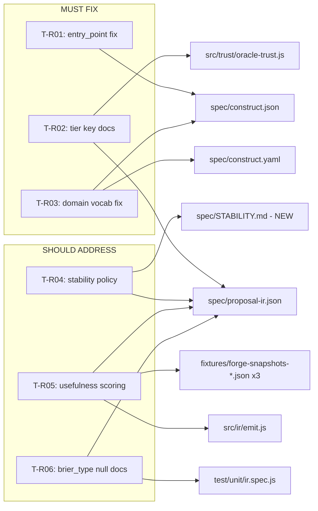

# Software Design Document: FORGE Tobias Review Response Sprint

**Version:** 1.0
**Date:** 2026-03-30
**Author:** Architecture Designer Agent
**Status:** Draft
**PRD Reference:** grimoires/loa/prd.md

---

## Table of Contents

1. [Project Architecture](#1-project-architecture)
2. [Software Stack](#2-software-stack)
3. [Data Design](#3-data-design)
4. [API Specifications](#4-api-specifications)
5. [Error Handling Strategy](#5-error-handling-strategy)
6. [Testing Strategy](#6-testing-strategy)
7. [Development Phases](#7-development-phases)
8. [Known Risks and Mitigation](#8-known-risks-and-mitigation)
9. [Open Questions](#9-open-questions)
10. [Appendix](#10-appendix)

---

## 1. Project Architecture

### 1.1 System Overview

This is a **fix sprint** — no new architecture, no new features, no new modules. All work operates within the existing FORGE pipeline boundaries. The sprint resolves six review findings from Tobias (Echelon) to clear integration friction before Cycle 002.

FORGE's architecture is unchanged: a Node.js 20+ pipeline with zero external runtime dependencies that classifies structured event feeds across five grammar dimensions, selects Theatre templates via rule-based matching, and emits versioned Proposal IR envelopes consumed by Echelon's admission gate.

### 1.2 Architectural Pattern

**Pattern:** Existing monolithic pipeline (no change)

**Justification:** This sprint modifies metadata, documentation, and one emitter function. The pipeline architecture (ingest → classify → select → emit) is untouched. No new components, services, or modules are introduced.

### 1.3 Change Map



### 1.4 Files Modified Per Task

| Task | File | Change Type | Description |
|------|------|-------------|-------------|
| T-R01 | `spec/construct.json` | Edit (2 fields) | `entry_point` and `context_files[0]`: `"BUTTERFREEZONE.md"` → `"README.md"` |
| T-R02 | `src/trust/oracle-trust.js` | Add (comment block) | Echelon provenance mapping documentation above `TRUST_REGISTRY` |
| T-R02 | `spec/proposal-ir.json` | Edit (description) | Echelon provenance mapping note on `trust_tier` field |
| T-R03 | `spec/construct.json` | Edit (1 value) | `"feed-characterization"` → `"feed-classification"` in `skills` array |
| T-R03 | `spec/construct.yaml` | Edit (values) | `feed_characterization` → `feed_classification` in `domain_claims` and `skill_manifest` |
| T-R04 | `spec/STABILITY.md` | Create (new) | IR schema stability policy document |
| T-R04 | `spec/proposal-ir.json` | Edit (description) | Stability policy reference in top-level `description` |
| T-R05 | `src/ir/emit.js` | Edit (emitter logic) | Add `usefulness_score` to each proposal in `annotated` array |
| T-R05 | `spec/proposal-ir.json` | Edit (schema) | Add `usefulness_score` as required field in `Proposal` definition |
| T-R05 | `fixtures/forge-snapshots-tremor.json` | Regenerate | Re-run pipeline to include per-proposal `usefulness_score` |
| T-R05 | `fixtures/forge-snapshots-breath.json` | Regenerate | Re-run pipeline to include per-proposal `usefulness_score` |
| T-R05 | `fixtures/forge-snapshots-corona.json` | Regenerate | Re-run pipeline to include per-proposal `usefulness_score` |
| T-R06 | `spec/proposal-ir.json` | Verify + edit (description) | Confirm no `null` in `brier_type` enum; add mapping documentation |
| T-R06 | `test/unit/ir.spec.js` | Add (1 test) | Test that all templates produce valid non-null `brier_type` |

---

## 2. Software Stack

### 2.1 Technology (No Changes)

| Category | Technology | Version | Notes |
|----------|------------|---------|-------|
| Runtime | Node.js | >=20.0.0 | Built-ins only, zero external runtime deps |
| Language | JavaScript (ESM) | ES2022 | `"type": "module"` in package.json |
| Testing | `node:test` | Built-in | Node.js native test runner |
| Crypto | `node:crypto` | Built-in | SHA-256 for proposal_id generation |

**No new dependencies introduced.** This sprint does not add any entries to `dependencies` or `devDependencies`.

---

## 3. Data Design

### 3.1 Schema Changes (IR)

The `spec/proposal-ir.json` JSON Schema is the closest equivalent to a data schema. Changes are **additive only**.

**Addition: `usefulness_score` field in Proposal definition (T-R05)**

Current `$defs.Proposal.properties` does not include `usefulness_score`. After this sprint:

```json
"usefulness_score": {
  "type": ["number", "null"],
  "minimum": 0,
  "maximum": 1,
  "description": "Economic usefulness score for this proposal (0-1). Computed from population_impact x regulatory_relevance x predictability x actionability. Null when the economic filter was not invoked (score_usefulness=false). Canonical location for per-proposal usefulness; the envelope-level usefulness_scores map is retained for backwards compatibility."
}
```

Added to `$defs.Proposal.required` array. Type is `["number", "null"]` — always present, null when economic filter not invoked.

**Verification: `brier_type` field (T-R06)**

Schema already has `"enum": ["binary", "multi_class"]` with no `null`, and `brier_type` is already in `required`. **No schema change needed for T-R06 — documentation and test only.**

### 3.2 Codebase Finding: Usefulness Score State

The architect agent read the actual fixtures and found:

- **TREMOR**: `usefulness_scores: {"0": 0.0594, ...}` — 5 entries for 5 proposals. Already per-proposal at envelope level.
- **BREATH**: `usefulness_scores: {"0": 0.34520625}` — 1 entry for 1 proposal. Already per-proposal at envelope level.
- **CORONA**: `usefulness_scores: {}` — empty, 0 proposals. Correct.

The envelope-level `usefulness_scores` map is already consistent across all three. The actual gap is that `usefulness_score` does not appear on individual proposal objects inside `envelope.proposals[i]`. That is what T-R05 adds.

---

## 4. API Specifications

### 4.1 Runtime API Change (T-R05)

**`emitEnvelope()` output shape change:**

Before:
```json
{
  "proposals": [
    { "proposal_id": "...", "template": "...", "params": {}, "confidence": 0.9, "rationale": "...", "brier_type": "binary" }
  ],
  "usefulness_scores": { "0": 0.0594 }
}
```

After:
```json
{
  "proposals": [
    { "proposal_id": "...", "template": "...", "params": {}, "confidence": 0.9, "rationale": "...", "brier_type": "binary", "usefulness_score": 0.0594 }
  ],
  "usefulness_scores": { "0": 0.0594 }
}
```

Envelope-level `usefulness_scores` map is **retained** for backwards compatibility.

### 4.2 Implementation Detail for `src/ir/emit.js`

In `emitEnvelope()`, the `annotated` array construction must be extended:

1. Initialize each proposal with `usefulness_score: null`
2. When `score_usefulness` is true, set `annotated[i].usefulness_score = score`
3. Envelope-level `usefulness_scores` map continues to be populated as before

```javascript
const annotated = proposals.map((p, i) => ({
  proposal_id: proposalId(feed_id, p.template, p.params),
  template:    p.template,
  params:      p.params,
  confidence:  p.confidence,
  rationale:   p.rationale,
  brier_type:  BRIER_TYPE[p.template],
  usefulness_score: null,
}));

if (score_usefulness) {
  const tier = source_metadata?.trust_tier ?? 'unknown';
  for (let i = 0; i < annotated.length; i++) {
    const score = computeUsefulness(annotated[i], feed_profile, { source_tier: tier });
    annotated[i].usefulness_score = score;
    usefulness_scores[String(i)] = score;
  }
}
```

### 4.3 No Other API Changes

All other public APIs (`ForgeConstruct.analyze()`, `classify()`, `selectTemplates()`, `getTrustTier()`, `canSettle()`, `validateSettlement()`, `computeUsefulness()`) are unchanged.

---

## 5. Error Handling Strategy

### 5.1 No New Error Paths

This sprint does not introduce new error-throwing code paths. The only behavioral change (`usefulness_score` on proposals) follows the existing pattern of attaching computed values to the annotated array.

### 5.2 Validation Test (T-R06)

A new test verifies all six templates produce valid non-null `brier_type`. The existing `BRIER_TYPE` map covers all templates exhaustively — the test confirms defense-in-depth.

---

## 6. Testing Strategy

### 6.1 Test Budget

| Category | Current | After Sprint | Notes |
|----------|---------|-------------|-------|
| Unit tests | 558 | 559+ | +1 for T-R06 brier_type validation |
| Convergence tests | 6 | 6 | Unchanged |
| **Total** | **566** | **567+** | Must be ≥ 566 |

### 6.2 New Test: brier_type Validation (T-R06)

**File:** `test/unit/ir.spec.js`

```javascript
it('every template type produces a non-null brier_type', () => {
  const templates = ['threshold_gate', 'cascade', 'divergence', 'regime_shift', 'anomaly', 'persistence'];
  for (const template of templates) {
    const env = emitEnvelope({
      feed_id: 'test',
      feed_profile: TREMOR_PROFILE,
      proposals: [{ template, params: {}, confidence: 0.5, rationale: 'test' }],
    });
    assert.ok(env.proposals[0].brier_type !== null);
    assert.ok(['binary', 'multi_class'].includes(env.proposals[0].brier_type));
  }
});
```

### 6.3 Existing Test Updates (T-R05)

Extend IR tests to assert `usefulness_score` exists on each proposal object when `score_usefulness=true`, and is `null` when `score_usefulness=false`.

### 6.4 Golden Envelope Regeneration (T-R05)

Regenerate by running the actual FORGE pipeline against each fixture with `score_usefulness: true`. Not hand-edited. Each proposal in each envelope will contain `usefulness_score`. CORONA's empty `proposals: []` remains unchanged.

---

## 7. Development Phases

### Phase 1: MUST FIX (T-R01, T-R02, T-R03)

#### T-R01: Fix construct.json entry_point
**Files:** `spec/construct.json` | **Effort:** XS

1. `entry_point`: `"BUTTERFREEZONE.md"` → `"README.md"`
2. `context_files[0]`: `"BUTTERFREEZONE.md"` → `"README.md"`
3. Verify `README.md` exists at repo root
4. Run `npm run test:all`

#### T-R02: Document settlement tier key distinction
**Files:** `src/trust/oracle-trust.js`, `spec/proposal-ir.json` | **Effort:** XS

1. Add comment block above `TRUST_REGISTRY` documenting string key format, TREMOR orthogonality, and Echelon provenance mapping (T0→signal_initiated high confidence, T1→signal_initiated Brier-discounted, T2→suggestion_promoted, T3→suggestion_unlinked)
2. Update `trust_tier` description in `spec/proposal-ir.json`
3. Run `npm run test:all`

#### T-R03: Verify domain claim vocabulary
**Files:** `spec/construct.json`, `spec/construct.yaml` | **Effort:** S

1. `spec/construct.json` skills array: `"feed-characterization"` → `"feed-classification"`
2. `spec/construct.yaml` domain_claims: `feed_characterization` → `feed_classification`
3. `spec/construct.yaml` skill_manifest entries: `domain: feed_characterization` → `domain: feed_classification`
4. **Conservative scope:** Only change `feed_characterization`. Flag other potential mismatches (see Open Questions Q1) for Tobias confirmation.
5. Run `npm run test:all`

### Phase 2: SHOULD ADDRESS (T-R04, T-R05, T-R06)

#### T-R04: Document IR stability policy
**Files:** `spec/STABILITY.md` (new), `spec/proposal-ir.json` | **Effort:** XS

1. Create `spec/STABILITY.md` covering: current version (0.1.0), stability status, breaking/non-breaking definitions, notice policy, Cycle 002 additive fields
2. Add stability policy reference to `spec/proposal-ir.json` top-level description
3. Run `npm run test:all`

#### T-R05: Fix usefulness scoring inconsistency
**Files:** `src/ir/emit.js`, `spec/proposal-ir.json`, `fixtures/forge-snapshots-*.json` (x3) | **Effort:** S

1. Extend `emitEnvelope()` to attach `usefulness_score` on each proposal object
2. Add `usefulness_score` as `["number", "null"]` required field in IR schema
3. Regenerate all 3 golden envelope snapshots via pipeline execution
4. Update IR tests to assert `usefulness_score` presence
5. Run `npm run test:all`

#### T-R06: Document brier_type null rejection
**Files:** `spec/proposal-ir.json`, `test/unit/ir.spec.js` | **Effort:** XS

1. Update `brier_type` description with cascade→multi_class mapping and null rejection note
2. Add validation test confirming all templates produce valid brier_type
3. Run `npm run test:all`

---

## 8. Known Risks and Mitigation

| Risk | Probability | Impact | Mitigation |
|------|-------------|--------|------------|
| T-R05 fixture regeneration changes `proposal_id` values | Very Low | High | `proposal_id` is deterministic from `feed_id + template + params`. Inputs unchanged → IDs identical. Diff old vs new. |
| T-R05 `usefulness_score: null` breaks Tobias's bridge tests | Low | Medium | Adding a new field with null is additive. JSON parsers ignore unknown fields by default. |
| T-R03 domain changes beyond `feed_characterization` needed | Low | Medium | Conservative: only change the explicitly flagged term. Flag rest for Tobias. |
| T-R05 convergence tests fail after fixture regeneration | Low | Medium | Convergence tests score pipeline properties, not snapshot values. |

---

## 9. Open Questions

| # | Question | Owner | Status |
|---|----------|-------|--------|
| Q1 | Should `construct.yaml` domain claims beyond `feed_characterization` align to Echelon vocabulary? Candidates: `prediction_markets`→`market_proposal`, `rlmf_export`→`rlmf_certificate`, `theatre_management`→`theatre_lifecycle`, `oracle_verification`→`oracle_trust`, `settlement_verification`→`settlement_accuracy`, `calibration_analysis`→`calibration_validity` | Tobias / el capitan | Open |
| Q2 | For T-R05, should `usefulness_score` be `["number", "null"]` (allowing null when filter not invoked) or always computed? **Recommendation: allow null** for backwards compat. | el capitan | Open |
| Q3 | The actual BREATH fixture already has per-proposal usefulness at envelope level (`{"0": 0.34520625}`). The real gap is absence of `usefulness_score` on proposal objects, not envelope-level inconsistency. Confirm this reading. | el capitan | Open |

---

## 10. Appendix

### A. File Inventory

| File | Action | Tasks |
|------|--------|-------|
| `spec/construct.json` | Edit | T-R01, T-R03 |
| `spec/construct.yaml` | Edit | T-R03 |
| `src/trust/oracle-trust.js` | Edit (add comments) | T-R02 |
| `spec/proposal-ir.json` | Edit (schema + descriptions) | T-R02, T-R04, T-R05, T-R06 |
| `spec/STABILITY.md` | Create (new) | T-R04 |
| `src/ir/emit.js` | Edit (emitter logic) | T-R05 |
| `fixtures/forge-snapshots-tremor.json` | Regenerate | T-R05 |
| `fixtures/forge-snapshots-breath.json` | Regenerate | T-R05 |
| `fixtures/forge-snapshots-corona.json` | Regenerate | T-R05 |
| `test/unit/ir.spec.js` | Edit (add tests) | T-R05, T-R06 |

### B. Echelon Provenance Mapping Reference

| FORGE Tier | Key Format | Echelon Provenance | Confidence |
|------------|-----------|-------------------|------------|
| T0 | String `"T0"` | signal_initiated | High |
| T1 | String `"T1"` | signal_initiated | Brier-discounted |
| T2 | String `"T2"` | suggestion_promoted | Needs corroboration |
| T3 | String `"T3"` | suggestion_unlinked | No settlement evidence |

### C. Change Log

| Version | Date | Changes | Author |
|---------|------|---------|--------|
| 1.0 | 2026-03-30 | Initial SDD for Tobias Review Response Sprint | Architecture Designer |

---

*Generated by Architecture Designer Agent*
