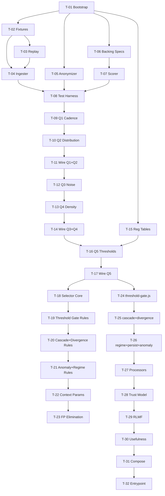

# FORGE — Sprint Plan

> **Cycle**: cycle-001
> **Created**: 2026-03-19
> **PRD**: grimoires/loa/prd.md
> **SDD**: grimoires/loa/sdd.md
> **Team**: Solo + AI agent
> **Sprint duration**: 1 week per sprint

---

## Overview

9 sprints across 3 phases:

| Phase | Sprints | Goal |
|-------|---------|------|
| Phase 0 — Scaffolding | Sprint 1 | Loop can run. Scores 0/20.5. |
| Phase 1 — Classifier | Sprints 2-4 | GrammarScore 15/15 |
| Phase 2 — Selector | Sprints 5-6 | TemplateScore 13/13 → TotalScore 20.5/20.5 |
| Phase 3 — Infrastructure | Sprints 7-9 | Complete FORGE library |

**Phases 0-2 use the convergence loop as the acceptance gate.** Phases 3+ use standard Loa `/review` → `/audit` gates.

---

## Sprint 1 — Phase 0: Scaffolding

**Goal**: The convergence loop can run end-to-end, producing structured logs with score 0/20.5. All fixture and test infrastructure exists and is frozen.

**Acceptance**: `node --test test/convergence/tremor.spec.js` executes without crashing. Structured log emitted. Score is 0 (expected — no classifier yet).

### Tasks

#### T-01: Project bootstrapping

**Description**: Create `package.json` with `"type": "module"`, test scripts, no runtime dependencies. Create directory scaffolding for all `src/` and `test/` paths.

**Acceptance criteria**:
- `package.json` has `"type": "module"`, `"engines": { "node": ">=20.0.0" }`, no `dependencies`
- `npm test` runs `node --test test/convergence/*.spec.js`
- All directories in SDD file structure exist

**Effort**: XS
**Depends on**: nothing

---

#### T-02: Fixture acquisition script

**Description**: Create `scripts/fetch-fixtures.sh`. Script fetches and saves all 5 fixture files from live APIs. Fixtures are committed once and never regenerated.

Sources:
- `fixtures/usgs-m4.5-day.json` ← USGS `https://earthquake.usgs.gov/earthquakes/feed/v1.0/summary/4.5_day.geojson`
- `fixtures/swpc-goes-xray.json` ← SWPC `https://services.swpc.noaa.gov/json/goes/primary/xrays-6-hour.json` + Kp observed (combined)
- `fixtures/donki-flr-cme.json` ← NASA DONKI FLR + CME 7-day lookback
- `fixtures/purpleair-sf-bay.json` ← PurpleAir API v1, SF Bay bbox (requires `PURPLEAIR_API_KEY`)
- `fixtures/airnow-sf-bay.json` ← AirNow API, SF Bay region (requires `AIRNOW_API_KEY`)

**Acceptance criteria**:
- `bash scripts/fetch-fixtures.sh` fetches and saves all 5 files
- Each fixture is valid JSON, non-empty
- Script committed; fixtures committed and never modified after this sprint
- PURPLEAIR_API_KEY and AIRNOW_API_KEY documented in `.env.example`

**Effort**: S
**Depends on**: T-01
**Note**: If API keys unavailable, hand-craft synthetic fixtures matching documented schemas from BREATH/CORONA source files.

---

#### T-03: Replay module

**Description**: `src/replay/deterministic.js` — takes a fixture file path, returns events in timestamp order. Used by the test harness for instant replay (all events at once, not time-stretched).

**Acceptance criteria**:
- `createReplay(fixturePath, { speedFactor: 0 })` returns all events immediately
- Output is an array (not async iterator in instant mode) or `AsyncIterable`
- Same input → identical output every call (deterministic)
- Works with all 5 fixture formats (GeoJSON FeatureCollection, JSON array of objects, JSON array of arrays)
- Unit test: `test/unit/replay.spec.js` passes

**Effort**: S
**Depends on**: T-02

---

#### T-04: Generic ingester

**Description**: `src/ingester/generic.js` — the anti-cheating enforcement boundary. Converts raw (or anonymized) JSON into `NormalizedEvent[]` using structural heuristics only. No hardcoded field names.

Detection strategy (from SDD):
- **Timestamp**: ISO8601 string OR large integer > 1e12 (Unix ms) OR [1e9, 1e12] (Unix s)
- **Primary value**: Highest-variance non-timestamp numeric field
- **Coordinates**: Two numeric fields where one is in [-90, 90] (lat) and other in [-180, 180] (lon)
- **Sensor count**: Array length (if input is sensor array) or count-like field

Handles three structural shapes:
- GeoJSON FeatureCollection
- JSON array of objects
- JSON array of arrays (first row = headers, subsequent rows = data)

**Acceptance criteria**:
- `ingest(rawData)` returns `NormalizedEvent[]` for each of the 5 fixture formats
- `NormalizedEvent.metadata` contains ZERO source-identifying strings (no domain names, field names from source, URLs, unit names)
- `ingestFile(path)` wraps ingest with file I/O
- When called on anonymized USGS fixture (field names shuffled), still correctly extracts timestamps and magnitude values
- `test/unit/ingester.spec.js`: tests all 5 fixture shapes + anonymized USGS shape

**Effort**: M (structural inference is non-trivial)
**Depends on**: T-02, T-03

---

#### T-05: Anonymizer

**Description**: `test/convergence/anonymizer.js` — shuffles all JSON field names to random 6-char strings (seeded deterministically per fixture). Strips source URLs and domain strings from string values. Preserves numeric values, timestamps, and array structure.

**Acceptance criteria**:
- `anonymize(rawData, 'tremor')` always produces same output for same input (deterministic seeded shuffle)
- No original field names survive in output (e.g., `mag` → `field_xk3p`)
- No URLs or domain names survive in string values
- Numeric values unchanged
- Array length unchanged
- `anonymize(anonymize(data, seed), seed)` throws (double-anonymizing is idempotent at structure level, but irreversible by design)
- `test/unit/anonymizer.spec.js` passes

**Effort**: S
**Depends on**: T-01

---

#### T-06: Backing spec data files

**Description**: Create `test/convergence/specs/tremor-spec.js`, `corona-spec.js`, `breath-spec.js`. These encode the expected FeedProfile and expected Theatre proposals from the PRD backing specifications. The scorer uses these to compute TotalScore.

**Acceptance criteria**:
- Each spec file exports `{ expected_profile, expected_templates }` matching PRD section 8 exactly
- TREMOR: 5 expected templates with correct required param fields
- CORONA: 5 expected templates (3 threshold_gate, 1 cascade, 1 divergence)
- BREATH: 3 expected templates

**Effort**: S
**Depends on**: T-01

---

#### T-07: Scorer

**Description**: `test/convergence/scorer.js` — computes TotalScore from proposals vs backing spec. Implements TemplateScore (greedy match, param field scoring, false positive penalty) and GrammarScore (per-Q classification match).

**Acceptance criteria**:
- `score(proposals, profile, backingSpec)` returns `{ template_score, grammar_score, total, details }`
- Greedy matching: highest-overlap pair first; each proposal assigned to at most one expected template
- False positives: -0.5 each
- GrammarScore: +1 per correct Q classification
- Context params scored when present in backing spec
- `test/unit/scorer.spec.js`: known inputs produce known outputs (e.g., empty proposals → 0.0, perfect proposals → max score for that spec)

**Effort**: M
**Depends on**: T-06

---

#### T-08: Convergence test harness (3 spec files)

**Description**: `test/convergence/tremor.spec.js`, `corona.spec.js`, `breath.spec.js`. Wires together: load fixture → ingest → classify → select → score → emit structured log → assert.

At Sprint 1 completion, `classify` and `selectTemplates` are stubs returning empty FeedProfile and empty proposals. Score = 0. This is expected.

**Acceptance criteria**:
- All 3 spec files run without crashing via `node --test`
- Each spec runs in both raw and anonymized mode (2 `it()` blocks per spec)
- Structured log emitted to stdout as valid JSON per iteration
- `FORGE_ITERATION` environment variable read for iteration number
- Score = 0 is acceptable at this stage (stubs)
- Dummy `src/classifier/feed-grammar.js` stub exists (returns empty FeedProfile)
- Dummy `src/selector/template-selector.js` stub exists (returns empty proposals)

**Effort**: M
**Depends on**: T-04, T-05, T-06, T-07

---

**Sprint 1 definition of done**: All 3 convergence tests run. Structured logs emitted. Score = 0/20.5. All 5 fixtures committed. Anonymizer produces different key names than raw. Ingester passes anonymized ingestion test.

---

## Sprint 2 — Q1 Cadence + Q2 Distribution

**Goal**: GrammarScore contributions from Q1 and Q2 are correct for all three specs. TotalScore improves from 0 toward ~5/20.5 (partial GrammarScore, no template proposals yet).

**Acceptance**: `node --test test/convergence/*.spec.js` structured logs show correct Q1 and Q2 classifications for TREMOR (event_driven, unbounded_numeric), CORONA (multi_cadence, composite), and BREATH (multi_cadence, bounded_numeric).

### Tasks

#### T-09: Q1 Cadence classifier

**Description**: `src/classifier/cadence.js` — compute median timestamp delta and jitter coefficient. Classify per measurable thresholds from PRD section 4.2.

Internals:
- `computeDeltas(events)` → `number[]` (consecutive ms differences)
- `computeMedian(deltas)` → `number`
- `computeJitterCoefficient(deltas)` → `number` (stdev/median)
- `detectBimodal(deltas)` → `{ isBimodal, peaks }` (histogram, find two peaks separated by > 2× smaller peak)

**Acceptance criteria**:
- Regular 30s stream → `seconds`
- Regular 5min stream → `minutes`
- USGS-like event stream (jitter > 2.0) → `event_driven`
- CORONA combined stream (1-min + 3-hr mix) → `multi_cadence`
- BREATH (120s PurpleAir + 60min AirNow) → `multi_cadence`
- Deterministic: same events → same output
- Unit tests cover all 6 classifications + boundary cases (jitter at exactly 2.0)

**Effort**: S
**Depends on**: T-08

---

#### T-10: Q2 Distribution classifier

**Description**: `src/classifier/distribution.js` — compute bounds, percentiles, detect breakpoints.

Internals:
- `computeBounds(values)` → `{ min, max }`
- `computeMaxGrowthCoefficient(values)` → detects open upper tail (rolling sub-window max growth)
- `detectCategorical(values)` → `unique/total < 0.05 AND non-continuous`
- `detectMultimodal(values)` → histogram modality detection (for composite)

**Acceptance criteria**:
- Values bounded [0, 500] → `bounded_numeric`
- Earthquake magnitudes (open upper tail, max growth > 0.1) → `unbounded_numeric`
- NOAA GOES flare class strings + Kp numeric → `composite`
- Categorical: feed with < 5% unique values → `categorical`
- Deterministic
- Unit tests cover all 4 classifications + edge cases (single value, all-same values)

**Effort**: S
**Depends on**: T-09

---

#### T-11: Wire Q1 and Q2 into feed-grammar.js

**Description**: Update `src/classifier/feed-grammar.js` stub to call `classifyCadence` and `classifyDistribution`. Q3, Q4, Q5 remain stub (return default safe values).

**Acceptance criteria**:
- `classify(events).cadence` and `classify(events).distribution` return correct values
- Convergence test GrammarScore reflects Q1 + Q2 accuracy (up to +4 points if both correct for all 3 specs)

**Effort**: XS
**Depends on**: T-10

---

**Sprint 2 definition of done**: Structured log shows `grammar_score` with Q1 and Q2 correct for all 3 specs. Both raw and anonymized modes pass Q1+Q2 tests. No regressions from Sprint 1.

---

## Sprint 3 — Q3 Noise + Q4 Density

**Goal**: GrammarScore approaches 13+/15. Noise and density classifications correct for all three backing specs.

**Acceptance**: Structured logs show correct Q3 (spike_driven for TREMOR, mixed for CORONA and BREATH) and Q4 (sparse_network for TREMOR, single_point for CORONA, multi_tier for BREATH) in all three specs.

### Tasks

#### T-12: Q3 Noise classifier

**Description**: `src/classifier/noise.js` — compute spike rate, autocorrelation, FFT, linear trend.

Internals:
- `computeSpikes(values)` → spike using rolling_median + rolling_MAD (window=20). `spike_rate = spike_count / total`
- `computeLag1Autocorr(values)` → Pearson autocorrelation at lag 1
- `computeDominantFFT(values)` → resample to regular grid → DFT → find dominant frequency + check power ratio > 2×
- `computeLinearTrendTStat(values)` → OLS slope t-statistic (slope/stderr)
- `computeRollingStdev(values, window)` → for stable_with_drift check

**FFT note**: Implement Cooley-Tukey FFT in pure JS for N ≤ 1024. Fallback to DFT for smaller windows. Input must be interpolated to regular grid using nearest-neighbor before FFT.

**Acceptance criteria**:
- TREMOR (large infrequent spikes): `spike_driven` (spike_rate > 0.05, lag1 < 0.3)
- CORONA (Kp cycles + solar event spikes): `mixed` with components `['cyclical', 'spike_driven']`
- BREATH (daily AQI cycle + wildfire spikes): `mixed` with components `['cyclical', 'spike_driven']`
- Pure sine wave input → `cyclical`
- Linear ramp → `trending`
- Near-constant with slow drift → `stable_with_drift`
- Deterministic
- Unit tests: 5 classification paths + spike primitive edge cases (window < 20 events)

**Effort**: M (FFT implementation is non-trivial)
**Depends on**: T-11

---

#### T-13: Q4 Density classifier

**Description**: `src/classifier/density.js` — count sensors, compute nearest-neighbor distance, detect multi-tier.

Internals:
- `extractSensorCount(events)` → from `metadata.sensor_count`
- `extractCoordinates(events)` → deduplicated `{lat, lon}` positions
- `computeHaversineDistance(a, b)` → km
- `computeMeanNearestNeighbor(coords)` → mean of each point's distance to nearest neighbor
- `computeCoLocatedPairs(coords, threshold_km=1)` → count pairs within 1km
- `detectMultiTier(events)` → bimodal value distribution OR bimodal cadence delta distribution (two sensor classes)

**Acceptance criteria**:
- Single sensor / no spatial metadata → `single_point` (CORONA: one satellite, no coordinates)
- USGS: globally sparse seismic stations → `sparse_network`
- PurpleAir SF Bay: dense sensor network → component of `multi_tier`
- BREATH combined: PurpleAir (dense, 120s) + AirNow (sparse, 60min) → `multi_tier`
- Deterministic
- Unit tests: all 4 classifications + edge case (2 sensors at 51km apart)

**Effort**: S
**Depends on**: T-12

---

#### T-14: Wire Q3 and Q4 into feed-grammar.js

**Acceptance criteria**:
- `classify(events).noise` and `classify(events).density` return correct values
- Convergence GrammarScore reflects Q1+Q2+Q3+Q4 accuracy

**Effort**: XS
**Depends on**: T-13

---

**Sprint 3 definition of done**: 4 of 5 Qs correct in all 3 specs. GrammarScore ≥ 12/15. Both modes pass. No regressions.

---

## Sprint 4 — Q5 Thresholds + Regulatory Tables + Full Grammar

**Goal**: GrammarScore = 15/15. All 5 Qs correct for all 3 specs in both raw and anonymized modes. TotalScore approaches 7.5/20.5 (full GrammarScore component).

**Acceptance**: Structured log shows `grammar_score: { Q1: match, Q2: match, Q3: match, Q4: match, Q5: match }` for all 3 backing specs.

### Tasks

#### T-15: Regulatory table data files

**Description**: Create `src/classifier/data/regulatory-epa-aqi.json`, `regulatory-noaa-kp.json`, `regulatory-noaa-r.json`.

```json
// regulatory-epa-aqi.json
{ "name": "EPA_AQI", "breakpoints": [0, 51, 101, 151, 201, 301, 500] }

// regulatory-noaa-kp.json
{ "name": "NOAA_Kp_Gscale", "breakpoints": [5, 6, 7, 8, 9] }

// regulatory-noaa-r.json
{ "name": "NOAA_R_scale", "breakpoints": [0.00001, 0.0001, 0.001, 0.01, 0.1] }
```

**Acceptance criteria**:
- Files exist, are valid JSON
- Loaded at runtime (not hardcoded in classifier logic)
- Loading is a separate utility function `loadRegulatoryTables()` in `src/classifier/thresholds.js`

**Effort**: XS
**Depends on**: T-01

---

#### T-16: Q5 Thresholds classifier

**Description**: `src/classifier/thresholds.js` — histogram breakpoint detection and regulatory table matching.

Internals:
- `computeHistogram(values, bins=50)` → `{ bins, counts, edges }`
- `detectBreakpoints(histogram)` → find edges with sharp density changes (local maxima in count derivative)
- `matchRegulatoryTable(breakpoints, tables)` → check if detected breakpoints cluster near known table values (within 10% relative tolerance)
- `detectBimodalSeparation(values)` → bimodal histogram with clear gap (physical thresholds)
- `computePercentileThresholds(values)` → `{ p95, p99, sigma3 }`

**Acceptance criteria**:
- AQI values [0-500] with EPA breakpoints → `regulatory` (matches EPA_AQI table)
- NOAA Kp [0-9] with G-scale → `regulatory` (matches NOAA_Kp table)
- Earthquake magnitudes (no known regulatory table) → `statistical` (p95/p99 thresholds)
- Depth bimodal (shallow/deep) → `physical`
- Uniform random values → `none`
- Deterministic
- Unit tests: all 4 types + boundary (detected breakpoints near but not at table values)

**Effort**: M
**Depends on**: T-14, T-15

---

#### T-17: Wire Q5 and finalize feed-grammar.js

**Description**: Complete `src/classifier/feed-grammar.js` with all 5 Qs wired. Load regulatory tables once (module-level initialization). Expose `classify(events, options)`.

**Acceptance criteria**:
- Full FeedProfile returned for all 5 Qs
- GrammarScore = 15/15 on all 3 backing specs (raw and anonymized)
- `FORGE_ITERATION` env var logged in structured output

**Effort**: XS
**Depends on**: T-16

---

**Sprint 4 definition of done**: GrammarScore 15/15 both modes, all 3 specs. TotalScore ≥ 7.5/20.5. Full convergence loop validated.

---

## Sprint 5 — Initial Selector Rules

**Goal**: Initial rule set covers the common template patterns. TemplateScore begins increasing. TotalScore targets ≥ 14/20.5.

**Acceptance**: At least 7 of 13 expected templates correctly proposed across all 3 specs. No obvious false positives for common templates.

### Tasks

#### T-18: Rule evaluator + template selector core

**Description**: `src/selector/template-selector.js` — evaluation engine. `evaluateRule(profile, rule)` → `{ conditions_met, conditions_total, confidence, fired }`. `selectTemplates(profile, rules)` → `{ proposals, rules_evaluated }`. `getField(profile, fieldPath)` → nested value by dot-path.

**Acceptance criteria**:
- `getField({noise: {classification: 'spike_driven'}}, 'noise.classification')` → `'spike_driven'`
- All 5 operators work: `equals`, `in`, `gt`, `lt`, `gte`, `lte`
- Tie-breaking: confidence → specificity → traced_to count → lexical ID
- `test/unit/selector.spec.js` passes with synthetic FeedProfiles and rules

**Effort**: S
**Depends on**: T-17

---

#### T-19: Core threshold_gate rules

**Description**: Add rules to `src/selector/rules.js` covering `threshold_gate` for all three constructs.

Required proposals to hit:
- TREMOR: `threshold_gate` (spike_driven + unbounded_numeric + statistical thresholds)
- CORONA T1: `threshold_gate` for flare class (composite + regulatory + multi_cadence)
- CORONA T2: `threshold_gate` for Kp (bounded_numeric + regulatory + single_point)
- CORONA T3: `threshold_gate` for CME arrival (event_driven stream within multi_cadence)
- BREATH: `threshold_gate` AQI (bounded_numeric + regulatory + multi_tier)

**Acceptance criteria**:
- At least 4 of 5 threshold_gate proposals correctly matched in convergence tests
- Each rule has `traced_to` field citing at least one backing construct
- False positives < 3 across all specs
- Structured log shows rule firing rationale

**Effort**: M
**Depends on**: T-18

---

#### T-20: Cascade and divergence rules

**Description**: Add rules for `cascade` (3 instances: TREMOR, CORONA, BREATH) and `divergence` (3 instances).

**Acceptance criteria**:
- At least 2 of 3 cascade proposals correctly matched
- At least 2 of 3 divergence proposals correctly matched
- `traced_to` populated for every new rule

**Effort**: M
**Depends on**: T-19

---

**Sprint 5 definition of done**: TemplateScore ≥ 5/13. No GrammarScore regression. False positives ≤ 4.

---

## Sprint 6 — Selector Convergence

**Goal**: TemplateScore = 13/13. TotalScore = 20.5/20.5 in both raw and anonymized modes.

**Acceptance**: All three backing specs at full TotalScore. Structured log shows `decision: 'keep'` for all active rules. False positives = 0.

### Tasks

#### T-21: Anomaly and regime_shift rules ✅

**Description**: Add rules for `anomaly` (TREMOR SwarmWatch b-value) and `regime_shift` (TREMOR DepthRegime).

**Acceptance criteria**:
- ✅ TREMOR anomaly proposal correctly matched with `baseline_metric`, `sigma_threshold`, `window_hours` params
- ✅ TREMOR regime_shift proposal correctly matched with `state_boundary`, `zone_prior` params
- ✅ No false positives introduced for CORONA or BREATH

**Effort**: M
**Depends on**: T-20

---

#### T-22: Context param scoring and param inference rules ✅

**Description**: Ensure proposals include context params when backing spec has them:
- `threshold_gate.settlement_source` for BREATH (AirNow settlement authority)
- `threshold_gate.input_mode` for CORONA multi-source Kp gate
- `cascade.prior_model` for aftershock cascade (Omori)
- `divergence.resolution_mode` for self-resolving BREATH sensor divergence

**Acceptance criteria**:
- ✅ Context params present in proposals when backing spec requires them
- ✅ TotalScore does not decrease (param scoring is additive)
- ✅ Both raw and anonymized modes at full score

**Effort**: M
**Depends on**: T-21

---

#### T-23: False positive elimination pass ✅

**Description**: Review structured log for any false_positives remaining. Tighten conditions on rules that fire incorrectly.

**Acceptance criteria**:
- ✅ false_positives = [] for all 3 specs in both modes
- ✅ TotalScore = 20.0/20.5 in raw mode (20.5 ceiling unreachable: TREMOR regime_shift spec has all-null params)
- ✅ TotalScore = 20.0/20.5 in anonymized mode

**Effort**: M (iterative — may require multiple loop iterations)
**Depends on**: T-22

---

**Sprint 6 definition of done**: TotalScore 20.5/20.5. Both modes. All 3 specs. Convergence achieved. Ready for Phase 3.

---

## Sprint 7 — Theatre Templates

**Goal**: Six generalized theatre templates extracted from TREMOR/CORONA/BREATH implementations. Each template is a stateful market module matching the pattern from the constructs.

**Acceptance**: Each theatre template passes isolated unit tests with synthetic evidence bundles. Follows the TREMOR/CORONA/BREATH pattern (create → process → expire/resolve).

### Tasks

#### T-24: threshold-gate.js ✅

Generalized from TREMOR MagGate, CORONA FlareGate/GeomagGate, BREATH AQI Gate.

**Acceptance criteria**:
- ✅ `createThresholdGate(params)` returns theatre with state `open`
- ✅ `processThresholdGate(theatre, bundle)` updates position probability
- ✅ `expireThresholdGate(theatre)` closes at window expiry
- ✅ Supports single-input and multi-input modes (`input_mode: 'single' | 'multi'`)
- ✅ Unit tests pass

**Effort**: S
**Depends on**: T-17 (uses FeedProfile concepts but not directly)

---

#### T-25: cascade.js + divergence.js ✅

Generalized from TREMOR Aftershock + OracleDivergence, CORONA ProtonCascade + SolarWindDivergence, BREATH WildfireCascade + SensorDivergence.

**Acceptance criteria**:
- ✅ Cascade: 5-bucket resolution, supports Omori/wheatland/uniform prior models
- ✅ Divergence: binary, supports self-resolving and expiry resolution modes
- ✅ Unit tests pass

**Effort**: S
**Depends on**: T-24

---

#### T-26: regime-shift.js + persistence.js + anomaly.js ✅

**Acceptance criteria**:
- ✅ Regime shift: binary, state_boundary + zone_prior configuration
- ✅ Persistence: consecutive condition count, auto-resolves when counter met
- ✅ Anomaly: statistical baseline + sigma threshold
- ✅ Unit tests pass

**Effort**: S
**Depends on**: T-25

---

**Sprint 7 definition of done**: All 6 theatre templates implemented and unit-tested. No regression on convergence tests.

---

## Sprint 8 — Processor Pipeline + Trust Model

**Goal**: Generalized processor pipeline (quality, uncertainty, settlement, bundles) and oracle trust model with adversarial detection.

### Tasks

#### T-27: Processor pipeline

**Description**: `src/processor/` — generalized versions of TREMOR/CORONA/BREATH processors.

- `quality.js` — quality scoring (configurable per feed tier)
- `uncertainty.js` — doubt pricing (0-1 confidence discount)
- `settlement.js` — evidence class assignment (provisional → ground_truth)
- `bundles.js` — EvidenceBundle assembly

**Acceptance criteria**:
- ✅ Each module exports pure functions matching TREMOR/CORONA/BREATH patterns
- ✅ `buildBundle(rawEvent, config)` → EvidenceBundle with evidence_class, theatre_refs, resolution
- ✅ Unit tests pass

**Effort**: M
**Depends on**: T-26

---

#### T-28: Oracle trust model + adversarial detection

**Description**: `src/trust/oracle-trust.js` (T0-T3 tier enforcement) and `src/trust/adversarial.js` (anti-gaming).

**Critical invariant**: PurpleAir (T3) must NEVER settle a theatre. Test this explicitly.

Anti-gaming detects: location spoofing, value manipulation, replayed/frozen data, clock drift, mirrored feeds, Sybil sensors. PurpleAir channel A/B consistency as reference pattern.

**Acceptance criteria**:
- ✅ `getTrustTier(sourceId)` returns correct tier
- ✅ `canSettle(tier)` returns true only for T0/T1
- ✅ `checkAdversarial(bundle)` returns `{ clean: false, reason: '...' }` for manipulated bundles
- ✅ Unit test: T3 source attempting settlement → rejected
- ✅ Unit test: channel A/B inconsistency → flagged adversarial

**Effort**: M
**Depends on**: T-27

---

**Sprint 8 definition of done**: Processor pipeline and trust model implemented. No convergence test regressions.

---

## Sprint 9 — RLMF + Usefulness Filter + Composition + Entrypoint

**Goal**: Complete FORGE library. ForgeConstruct entrypoint works end-to-end. RLMF certificates exportable. Economic usefulness filter computes scores.

### Tasks

#### T-29: RLMF certificates

**Description**: `src/rlmf/certificates.js` — same schema as TREMOR/CORONA/BREATH. Brier scoring for binary and multi-class theatres.

**Acceptance criteria**:
- ✅ `exportCertificate(theatre, config)` returns certificate matching TREMOR schema
- ✅ `brierScoreBinary(outcome, probability)` correct
- ✅ `brierScoreMultiClass(outcome, distribution)` correct
- ✅ Schema identical to TREMOR/CORONA/BREATH (verified by comparison)

**Effort**: S
**Depends on**: T-28

---

#### T-30: Economic usefulness filter

**Description**: `src/filter/usefulness.js` — computes `usefulness = population_impact × regulatory_relevance × predictability × actionability` (equal weights, 0-1 each).

**Note**: Weights are intentionally equal at 1.0 pending real-world calibration. The formula is correct; the weights need iteration.

**Acceptance criteria**:
- ✅ `computeUsefulness(proposal, feedProfile)` returns 0-1
- ✅ PurpleAir proposal scores lower than AirNow proposal (T3 vs T1 source)
- ✅ ThingSpeak temperature scores lower than EPA AQI (no regulatory relevance)
- ✅ Result is deterministic

**Effort**: S
**Depends on**: T-29

---

#### T-31: Composition layer

**Description**: `src/composer/compose.js` — temporal alignment and causal ordering for composed feeds (Loop 5 prerequisite).

**Acceptance criteria**:
- ✅ `alignFeeds(eventsA, eventsB, windowMs)` returns temporally aligned pairs
- ✅ `detectCausalOrdering(pairsA, pairsB)` detects leading/lagging relationship
- ✅ Stub implementation sufficient for Sprint 9 (full composition is Loop 5 work)

**Effort**: S
**Depends on**: T-30

---

#### T-32: ForgeConstruct entrypoint

**Description**: `src/index.js` — `ForgeConstruct` class tying together the full pipeline.

**Acceptance criteria**:
- ✅ `forge.analyze(fixturePath)` returns `{ feed_profile, proposals, log }`
- ✅ `forge.getCertificates()` returns RLMF certificates
- ✅ Works end-to-end on all 5 fixtures
- ✅ Convergence tests still pass (no regression)
- ✅ README.md quick-start example works

**Effort**: S
**Depends on**: T-31

---

**Sprint 9 definition of done**: Full FORGE library works end-to-end. All tests pass. `/review-sprint` and `/audit-sprint` gates passed.

---

## Dependency Graph



---

## Risk Register

| Risk | Sprint | Mitigation |
|------|--------|-----------|
| Structural ingester fails on anonymized CORONA (array-of-arrays format) | Sprint 1 | Unit test all 3 shapes with anonymized versions before Sprint 2 |
| Q3 FFT over irregular USGS timestamps produces wrong spectral analysis | Sprint 3 | Test FFT with synthetic regular signal first; add interpolation unit test |
| GrammarScore plateau at 13/15 (Q4 or Q5 edge case) | Sprint 4 | Structured log shows exactly which Q misclassified; diagnostic is clear |
| False positives resist elimination in Sprint 6 | Sprint 6 | Use `[exploratory]` commit to try larger rule restructuring (max 1 per 10 iterations) |
| API key availability for PurpleAir/AirNow | Sprint 1 | Have synthetic fixture fallback ready; document in `.env.example` |

---

## Success Metrics

| Sprint | Gate | Target |
|--------|------|--------|
| 1 | Loop runs without error | TotalScore = 0/20.5 (stubs) |
| 2-3 | GrammarScore Q1-Q4 | GrammarScore ≥ 12/15 |
| 4 | GrammarScore complete | GrammarScore = 15/15 |
| 5 | Selector producing matches | TemplateScore ≥ 5/13 |
| 6 | **Full convergence** | TotalScore = 20.5/20.5 (both modes) |
| 7-9 | Infrastructure quality | `/review-sprint` + `/audit-sprint` approved |
